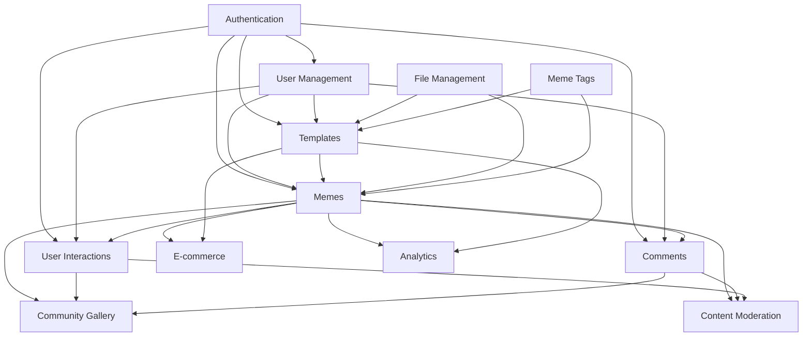

# Features Documentation

This directory contains comprehensive feature specifications for the ILoveMemes platform. Each feature is documented with detailed requirements, API specifications, database schemas, and business logic.

## Documentation Structure

Each feature follows a standardized documentation format:

```text
features/
├── <feature-name>/
│   ├── feature-specification.md     # Complete feature specification
│   ├── use-cases/                   # Detailed use case scenarios
│   ├── api-examples.md              # API request/response examples
│   └── diagrams/                    # Mermaid diagrams and flowcharts
```

## Feature Categories

### Core Content Features

Features related to content creation, management, and organization.

#### [Memes](./memes/feature-specification.md)

**Status**: ✅ Implemented

The core content creation system that enables users to create, manage, and share meme instances.

**Key Capabilities**:

- Create memes from templates
- Personal meme library management
- Public/private audience control
- Search and filtering
- Soft deletion with audit trail

**Endpoints**: `/v1/memes`

**Database Tables**: `memes`, `meme_tags`

---

#### [Meme Templates](./meme-templates/feature-specification.md)

**Status**: ✅ Implemented

The template system that defines reusable canvas layouts with configurable layers for meme creation.

**Key Capabilities**:

- Template creation with layer definitions
- Text and image layer configuration
- Canvas properties management
- Template versioning
- Publishing workflow
- Template categorization

**Endpoints**: `/v1/templates`

**Database Tables**: `templates`, `template_tags`

---

#### [Categories & Tags](./categories-tags/feature-specification.md)

**Status**: ✅ Implemented

Flexible taxonomy system for organizing and discovering memes and templates.

**Key Capabilities**:

- Tag creation and management
- Tag assignment to content
- Tag-based search and filtering
- Popular tags tracking
- Tag autocomplete
- Tag merging and cleanup

**Endpoints**: `/v1/tags`

**Database Tables**: `tags`, `meme_tags`, `template_tags`, `tag_categories`

---

### User & Social Features

Features related to user interactions, community engagement, and social functionality.

#### [User Interactions](./user-interactions/feature-specification.md)

**Status**: ✅ Documented

Social interaction system for upvotes, downvotes, reports, and flags with trending algorithms.

**Key Capabilities**:

- Upvote/downvote memes with toggle logic
- Report inappropriate content (7 reason categories)
- Flag for lighter moderation
- Track interaction counts and aggregations
- Sort/filter memes by interactions
- Trending score calculation with time decay
- Controversy score for polarizing content
- Report threshold auto-moderation
- Rate limiting with Redis

**Endpoints**: `/v1/memes/:id/interactions`, `/v1/memes/:id/vote`, `/v1/memes/:id/report`

**Database Tables**: `meme_interactions`, materialized views

---

#### [Comments](./comments/feature-specification.md)

**Status**: ✅ Documented

Threaded comment system enabling discussions on memes with moderation capabilities.

**Key Capabilities**:

- Comment creation on memes
- Threaded/nested comments (5-level depth)
- Comment editing with time window (24h)
- Soft deletion preserving structure
- User mentions (@username)
- Comment reporting and moderation
- Pagination and sorting (newest/oldest/popular)
- Comment counts and reply tracking
- Profanity filtering and spam detection

**Endpoints**: `/v1/memes/:id/comments`, `/v1/comments/:id/replies`, `/v1/comments/:id/report`

**Database Tables**: `comments`, `comment_reports`, `comment_edit_history`

---

#### [Meme Tags (Enhanced)](./meme-tags/feature-specification.md)

**Status**: ✅ Documented

Dynamic tagging system with automatic tag creation and many-to-many relationships.

**Key Capabilities**:

- Dynamic tag creation on-demand
- Tag normalization and deduplication
- Many-to-many relationships (tags ↔ memes, tags ↔ templates)
- Tag autocomplete and search
- Tag trending and popularity tracking
- Tag merging and aliasing
- Tag moderation and approval workflow
- Tag hierarchies (parent-child)
- Tag blacklisting
- Bulk tag operations

**Endpoints**: `/v1/tags/find-or-create`, `/v1/memes/:id/tags`, `/v1/templates/:id/tags`, `/v1/tags/search`

**Database Tables**: `tags`, `meme_tags`, `template_tags`, `tag_blacklist`

---

#### Community Gallery

**Status**: 🔄 Planned

Public meme gallery with social interactions, trending algorithms, and content discovery.

**Planned Capabilities**:

- Public meme feed
- Trending meme identification
- Share functionality
- User profiles and creator pages

---

### E-commerce Features

Features related to product management, checkout, and order fulfillment.

#### E-commerce Integration

**Status**: 🔄 Planned

Product catalog and order management with Shopify and Stripe integration.

**Planned Capabilities**:

- Product catalog management
- Meme-to-product mapping
- Product mockup generation
- Shopping cart
- Checkout flow
- Shopify integration
- Stripe payment processing
- Order management
- Label generation (300 DPI print-ready)

**Planned Endpoints**: `/v1/products/*`, `/v1/orders/*`, `/v1/checkout/*`

---

#### Product Customization

**Status**: 🔄 Planned

System for applying memes to product mockups and generating product previews.

**Planned Capabilities**:

- Product mockup templates
- Meme application to products
- Preview generation
- Product variants
- Customization options
- Preview sharing

**Planned Endpoints**: `/v1/products/:id/preview`

---

### Content Management Features

Features related to content moderation, analytics, and administration.

#### Content Moderation

**Status**: 🔄 Planned

Automated and manual content moderation system for maintaining community standards.

**Planned Capabilities**:

- Profanity filter
- NSFW image detection
- Spam prevention
- User reporting system
- Admin moderation queue
- Content flagging
- User warnings and bans
- Moderation dashboard

**Planned Endpoints**: `/v1/moderation/*`

---

#### Analytics & Metrics

**Status**: 🔄 Planned

Analytics system for tracking content performance, user engagement, and platform metrics.

**Planned Capabilities**:

- Template usage statistics
- Meme performance metrics
- User engagement analytics
- Trending content identification
- Time-windowed analysis
- Admin dashboard
- Export reports

**Planned Endpoints**: `/v1/analytics/*`, `/v1/metrics/*`

---

### Infrastructure Features

Core infrastructure and supporting features.

#### Authentication & Authorization

**Status**: ✅ Implemented

User authentication system with JWT, social login, and role-based access control.

**Key Capabilities**:

- User registration and login
- JWT-based authentication
- Social authentication (Google, Facebook, Apple)
- Role-based access control (Admin/User)
- Password reset flow
- Email verification
- Session management

**Endpoints**: `/v1/auth/*`

**Related Documentation**: [docs/auth.md](../auth.md)

---

#### File Management

**Status**: ✅ Implemented

Multi-storage file management system for images and assets.

**Key Capabilities**:

- Multi-storage support (S3, Local)
- Image upload and validation
- File size and type restrictions
- Temporary vs permanent file handling
- File cleanup
- CDN integration ready

**Endpoints**: `/v1/files/*`

**Related Documentation**: [docs/file-uploading.md](../file-uploading.md)

---

#### User Management

**Status**: ✅ Implemented

User profile and account management system.

**Key Capabilities**:

- User profile management
- Account settings
- Profile updates
- Account deletion
- User roles and permissions

**Endpoints**: `/v1/users/*`

---

## Feature Status Legend

- ✅ **Implemented**: Feature is live and production-ready
- � **Documented**: Feature specification complete, ready for development
- �🔄 **Planned**: Feature is planned for future implementation
- 🚧 **In Progress**: Feature is currently under development
- 🔍 **In Review**: Feature is complete and under review
- ⏸️ **On Hold**: Feature development is paused
- ❌ **Deprecated**: Feature is no longer supported

---

## Feature Dependencies

### Core Dependencies



### Integration Flow

1. **Authentication** provides user context for all features
2. **File Management** handles asset storage for memes and templates
3. **Templates** define structure for **Memes**
4. **Meme Tags** organize both **Memes** and **Templates** with dynamic creation
5. **Memes** power **User Interactions**, **Comments**, **Community Gallery**, **E-commerce**, and **Analytics**
6. **User Interactions** and **Comments** feed into **Community Gallery** and **Content Moderation**

---

## Feature Implementation Priority

### Phase 1: Core Platform (Q4 2025)

- ✅ Authentication & Authorization
- ✅ User Management
- ✅ File Management
- ✅ Meme Templates
- ✅ Memes
- ✅ Categories & Tags (Basic)

### Phase 2: Community & Engagement (Q1 2026)

- � User Interactions (Documented)
- 📝 Comments System (Documented)
- � Meme Tags - Enhanced (Documented)
- 🔄 Community Gallery
- 🔄 Content Moderation (Basic)
- 🔄 Analytics (Basic)

### Phase 3: E-commerce (Q2 2026)

- 🔄 E-commerce Integration
- 🔄 Product Customization
- 🔄 Order Management
- 🔄 Label Generation

### Phase 4: Advanced Features (Q3 2026)

- 🔄 AI-powered recommendations
- 🔄 Advanced analytics
- 🔄 Social sharing enhancements
- 🔄 Mobile app support

---

## Documentation Standards

All feature specifications follow these standards:

### Required Sections

1. **Feature Overview**: Purpose, scope, and objectives
2. **Functional Requirements**: Detailed FR with acceptance criteria
3. **Non-Functional Requirements**: Performance, security, scalability
4. **Database Schema**: Entity definitions and relationships
5. **API Endpoints**: Complete endpoint documentation
6. **Business Logic**: Algorithms and validation rules
7. **Integration Points**: Dependencies and external integrations
8. **Testing Strategy**: Unit, integration, and E2E tests
9. **Monitoring & Logging**: Metrics and alerting
10. **Future Enhancements**: Roadmap and planned improvements

### Documentation Format

- **Markdown** for all documentation
- **Mermaid** for diagrams and flowcharts
- **Code blocks** for examples and schemas
- **Gherkin syntax** for acceptance criteria
- **HTTP examples** for API documentation

### Naming Conventions

- Feature directories: `kebab-case`
- Files: `kebab-case.md`
- Headers: Title Case
- Code: Language-specific conventions

---

## Contributing to Documentation

### Adding a New Feature

1. Create feature directory: `docs/features/<feature-name>/`
2. Copy template: `feature-specification.md`
3. Fill all required sections
4. Add to this README with status and description
5. Update dependency graph if needed
6. Create PR for review

### Updating Existing Features

1. Update relevant sections in feature specification
2. Update version in changelog
3. Update status in this README if needed
4. Create PR with description of changes

### Documentation Review Process

1. Technical accuracy review
2. Completeness check
3. Standards compliance
4. Cross-reference validation
5. Approval and merge

---

## Quick Reference

### Common Endpoints

| Feature           | Base Path                | Authentication    |
| ----------------- | ------------------------ | ----------------- |
| Authentication    | `/v1/auth`               | Public/Required   |
| Users             | `/v1/users`              | Required          |
| Memes             | `/v1/memes`              | Optional/Required |
| Templates         | `/v1/templates`          | Optional/Required |
| Tags              | `/v1/tags`               | Optional/Required |
| Files             | `/v1/files`              | Required          |
| User Interactions | `/v1/memes/:id/vote`     | Required          |
| Comments          | `/v1/memes/:id/comments` | Optional/Required |
| Meme Tags         | `/v1/memes/:id/tags`     | Optional/Required |

### Common Response Format

All API endpoints follow a consistent response format:

```json
{
  "success": true,
  "message": "Operation successful",
  "data": { },
  "meta": {
    "page": 1,
    "limit": 20,
    "total": 100,
    "totalPages": 5
  }
}
```

### Error Response Format

```json
{
  "success": false,
  "message": "Error message",
  "errors": {
    "field": "Specific error details"
  },
  "statusCode": 400
}
```

---

## Additional Resources

- [API Reference](../api-reference.md) - Complete API documentation
- [Architecture Overview](../architecture.md) - System architecture
- [Database Schema](../database.md) - Database design
- [Testing Guide](../tests.md) - Testing strategies
- [Installation Guide](../installing-and-running.md) - Setup instructions

---

## Contact & Support

For questions about feature documentation:

- Create an issue in the repository
- Contact the development team
- Refer to [CONTRIBUTING.md](../../CONTRIBUTING.md)

---

**Last Updated**: November 7, 2025

**Documentation Version**: 1.0.0
