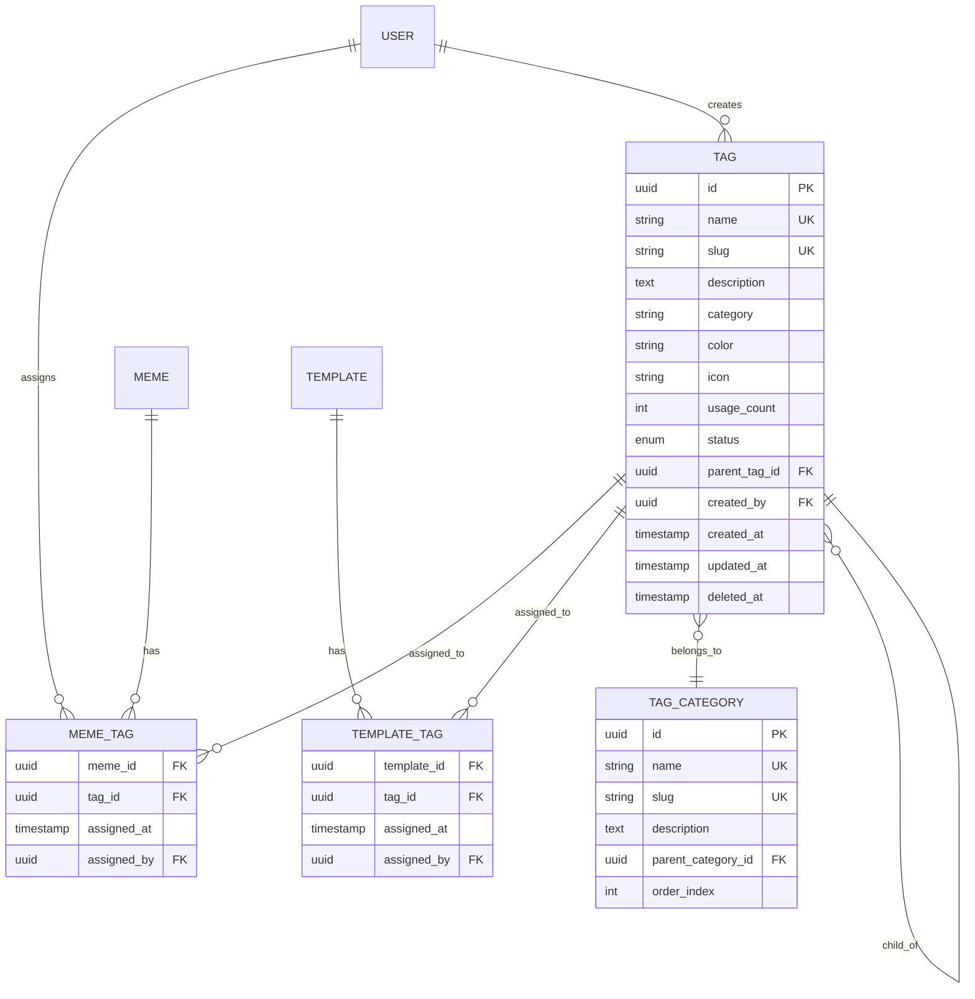

# Feature Specification: Categories & Tags

## Feature Overview

### Purpose & Scope

The Categories & Tags feature provides a flexible taxonomy system for organizing and discovering memes, templates, and
content across the ILoveMemes platform. This feature enables content classification, improved search capabilities, and
enhanced user navigation.

**Business Objective**: Create an intuitive content organization system that improves content discoverability, enhances
user experience, and supports content curation strategies.

**Manufacturing Impact**: This is a classification and inventory management system that enables efficient content
categorization, similar to SKU classification in manufacturing systems.

### Functional Boundaries

#### In Scope

- Tag creation and management (CRUD)
- Category hierarchy management
- Tag assignment to memes and templates
- Tag search and filtering
- Tag popularity tracking
- Tag normalization and deduplication
- Tag suggestions and autocomplete
- Tag moderation and cleanup
- Category-based navigation

#### Out of Scope

- Tag-based recommendations (AI/ML feature)
- User-generated tag validation
- Tag translation/localization
- Tag analytics dashboards
- Social tag following
- Tag-based notifications

### Success Metrics

- Tags created per month
- Tag usage rate (content items per tag)
- Tag search usage
- Tag coverage (% of content tagged)
- Average tags per content item
- Tag discovery rate
- Tag cleanup efficiency

---

## Functional Requirements

### FR-1: Tag Creation

**Priority**: High

**Description**: System and users must be able to create tags for content organization.

**Acceptance Criteria**:

```gherkin
Given an authenticated user (admin or regular)
When the user creates a tag
  With a name and optional description
Then a new tag is created
  And the tag name is normalized (lowercase, trimmed)
  And duplicate tags are prevented
  And the tag slug is generated
  And the tag is available for assignment
```

**Business Rules**:

- Tag names are case-insensitive and normalized
- Duplicate tag names are not allowed
- Tag names must be 2-50 characters
- Special characters are converted to hyphens in slugs
- Admins can create tags directly
- Regular users create tags implicitly when tagging content
- Tags require approval for public visibility (optional)

**Data Requirements**:

```typescript
interface CreateTagDto {
  name: string;                     // Required, 2-50 characters
  description?: string;             // Optional, max 500 characters
  category?: string;                // Optional, e.g., "emotion", "style", "topic"
  color?: string;                   // Optional, hex color for UI display
  icon?: string;                    // Optional, icon identifier
  status?: 'ACTIVE' | 'PENDING' | 'ARCHIVED'; // Default: ACTIVE
}

interface TagResponse {
  id: string;
  name: string;
  slug: string;
  description?: string;
  category?: string;
  color?: string;
  icon?: string;
  usageCount: number;              // Number of items using this tag
  status: 'ACTIVE' | 'PENDING' | 'ARCHIVED';
  createdAt: Date;
  updatedAt: Date;
}
```

### FR-2: Tag Assignment

**Priority**: Critical

**Description**: Users must be able to assign tags to memes and templates.

**Acceptance Criteria**:

```gherkin
Given a user has permission to edit content
When the user assigns tags to a meme or template
Then the tags are associated with the content
  And tag usage count is incremented
  And tags appear in content metadata
  And tags are searchable
```

**Assignment Rules**:

- Maximum 10 tags per content item
- Tags can be added during creation or later
- Tags can be removed by content owner or admin
- Tag assignment is case-insensitive
- Non-existent tags are created automatically (if enabled)
- Duplicate tag assignments are prevented

### FR-3: Tag Search & Filtering

**Priority**: Critical

**Description**: Users must be able to find content using tags.

**Acceptance Criteria**:

```gherkin
Given content has been tagged
When a user searches by tag
Then relevant content is returned
  And results can be filtered by multiple tags (AND/OR logic)
  And results are paginated
  And tag popularity influences search ranking
```

**Search Capabilities**:

- Single tag filtering
- Multiple tag filtering (AND/OR operations)
- Tag autocomplete
- Tag suggestions based on partial input
- Popular tags display
- Related tags suggestions

### FR-4: Tag Management

**Priority**: High

**Description**: Admins must be able to manage tags including merging, renaming, and archiving.

**Acceptance Criteria**:

```gherkin
Given an admin user
When managing tags
Then the admin can:
  - Rename tags (updates all associations)
  - Merge duplicate tags
  - Archive unused tags
  - Delete tags (with content reassignment)
  - Bulk tag operations
  - Tag moderation (approve/reject)
```

**Management Operations**:

1. **Rename**: Update tag name, regenerate slug, maintain associations
2. **Merge**: Combine multiple tags into one, update all associations
3. **Archive**: Hide tag from public use but preserve associations
4. **Delete**: Remove tag and optionally reassign content
5. **Bulk Edit**: Apply operations to multiple tags

### FR-5: Category Management

**Priority**: Medium

**Description**: System must support hierarchical categorization of tags.

**Acceptance Criteria**:

```gherkin
Given tags can be organized into categories
When admin creates a category
Then tags can be assigned to that category
  And categories can have parent categories
  And category hierarchy is maintained
  And navigation reflects category structure
```

**Category Structure**:

```
Root Categories:
├── Emotions
│   ├── Happy
│   ├── Sad
│   └── Angry
├── Styles
│   ├── Vintage
│   ├── Modern
│   └── Minimalist
├── Topics
│   ├── Politics
│   ├── Sports
│   └── Technology
└── Occasions
    ├── Birthday
    ├── Holiday
    └── Anniversary
```

---

## Non-Functional Requirements

### Performance Requirements

| Operation        | Target Response Time | Maximum Load |
|------------------|----------------------|--------------|
| Create Tag       | < 100ms              | 50 req/min   |
| Get Tag by ID    | < 50ms               | 1000 req/min |
| List Tags        | < 150ms              | 500 req/min  |
| Search Tags      | < 200ms              | 300 req/min  |
| Tag Autocomplete | < 100ms              | 500 req/min  |
| Assign Tag       | < 100ms              | 200 req/min  |
| Popular Tags     | < 100ms              | 1000 req/min |

### Security Requirements

- **Authentication**: Tag creation may require authentication (configurable)
- **Authorization**: Only admins can delete or merge tags
- **Input Validation**: Tag names sanitized to prevent XSS
- **Rate Limiting**: Prevent tag spam
- **Moderation**: Optional tag approval workflow

### Data Integrity

- **Unique Constraints**: Tag names (case-insensitive)
- **Foreign Key Constraints**: Tag-content associations
- **Referential Integrity**: Cascade rules for deletions
- **Transaction Support**: Tag operations are atomic
- **Normalization**: Tag names normalized before storage

### Scalability Requirements

- Support 10,000+ unique tags
- Handle 100,000+ tag assignments
- Efficient tag search with autocomplete
- Database indexing on tag names and slugs
- Cache popular tags for performance

---

## Database Schema

### Tag Entity

```sql
CREATE TABLE tags (
  id UUID PRIMARY KEY DEFAULT gen_random_uuid(),
  name VARCHAR(50) NOT NULL UNIQUE,
  slug VARCHAR(60) NOT NULL UNIQUE,
  description TEXT,
  category VARCHAR(50),
  color VARCHAR(7),                    -- Hex color code
  icon VARCHAR(50),                    -- Icon identifier
  usage_count INTEGER DEFAULT 0,
  status VARCHAR(20) DEFAULT 'ACTIVE',

  -- Hierarchy (optional)
  parent_tag_id UUID REFERENCES tags(id),

  -- Metadata
  created_by UUID REFERENCES users(id),

  -- Timestamps
  created_at TIMESTAMP DEFAULT CURRENT_TIMESTAMP,
  updated_at TIMESTAMP DEFAULT CURRENT_TIMESTAMP,
  deleted_at TIMESTAMP NULL,

  -- Indexes
  INDEX idx_tags_name (name),
  INDEX idx_tags_slug (slug),
  INDEX idx_tags_category (category),
  INDEX idx_tags_usage_count (usage_count DESC),
  INDEX idx_tags_status (status),
  INDEX idx_tags_created_at (created_at DESC),

  -- Full-text search
  INDEX idx_tags_search USING gin(to_tsvector('english', name || ' ' || COALESCE(description, ''))),

  -- Constraints
  CONSTRAINT chk_status CHECK (status IN ('ACTIVE', 'PENDING', 'ARCHIVED')),
  CONSTRAINT chk_name_length CHECK (LENGTH(name) >= 2 AND LENGTH(name) <= 50)
);

-- Meme Tags (Many-to-Many)
CREATE TABLE meme_tags (
  meme_id UUID REFERENCES memes(id) ON DELETE CASCADE,
  tag_id UUID REFERENCES tags(id) ON DELETE CASCADE,
  assigned_at TIMESTAMP DEFAULT CURRENT_TIMESTAMP,
  assigned_by UUID REFERENCES users(id),
  PRIMARY KEY (meme_id, tag_id),
  INDEX idx_meme_tags_meme (meme_id),
  INDEX idx_meme_tags_tag (tag_id)
);

-- Template Tags (Many-to-Many)
CREATE TABLE template_tags (
  template_id UUID REFERENCES templates(id) ON DELETE CASCADE,
  tag_id UUID REFERENCES tags(id) ON DELETE CASCADE,
  assigned_at TIMESTAMP DEFAULT CURRENT_TIMESTAMP,
  assigned_by UUID REFERENCES users(id),
  PRIMARY KEY (template_id, tag_id),
  INDEX idx_template_tags_template (template_id),
  INDEX idx_template_tags_tag (tag_id)
);

-- Tag Categories (for hierarchical organization)
CREATE TABLE tag_categories (
  id UUID PRIMARY KEY DEFAULT gen_random_uuid(),
  name VARCHAR(50) NOT NULL UNIQUE,
  slug VARCHAR(60) NOT NULL UNIQUE,
  description TEXT,
  parent_category_id UUID REFERENCES tag_categories(id),
  order_index INTEGER DEFAULT 0,
  created_at TIMESTAMP DEFAULT CURRENT_TIMESTAMP,
  updated_at TIMESTAMP DEFAULT CURRENT_TIMESTAMP
);
```

### Relationships



---

## API Endpoints

### Create Tag

```http
POST /v1/tags
Authorization: Bearer <token>
Content-Type: application/json

Request Body:
{
  "name": "Funny",
  "description": "Humorous and comedic content",
  "category": "emotion",
  "color": "#FF5733",
  "status": "ACTIVE"
}

Response 201 Created:
{
  "success": true,
  "message": "Tag created successfully",
  "data": {
    "id": "tag-uuid",
    "name": "funny",
    "slug": "funny",
    "description": "Humorous and comedic content",
    "category": "emotion",
    "color": "#FF5733",
    "usageCount": 0,
    "status": "ACTIVE",
    "createdAt": "2025-11-07T10:00:00Z",
    "updatedAt": "2025-11-07T10:00:00Z"
  }
}
```

### Get Tag List

```http
GET /v1/tags?page=1&limit=50&search=fun&category=emotion&sort=usageCount
Authorization: Optional

Response 200 OK:
{
  "success": true,
  "message": "Tags fetched successfully",
  "data": [
    {
      "id": "tag-uuid",
      "name": "funny",
      "slug": "funny",
      "description": "Humorous and comedic content",
      "category": "emotion",
      "color": "#FF5733",
      "usageCount": 1523,
      "status": "ACTIVE",
      "createdAt": "2025-11-07T10:00:00Z"
    }
  ],
  "meta": {
    "page": 1,
    "limit": 50,
    "total": 234,
    "totalPages": 5
  }
}
```

### Get Popular Tags

```http
GET /v1/tags/popular?limit=20
Authorization: Optional

Response 200 OK:
{
  "success": true,
  "message": "Popular tags fetched successfully",
  "data": [
    {
      "id": "tag-uuid",
      "name": "funny",
      "slug": "funny",
      "usageCount": 5234,
      "color": "#FF5733"
    },
    {
      "id": "tag-uuid-2",
      "name": "wholesome",
      "slug": "wholesome",
      "usageCount": 3421,
      "color": "#33FF57"
    }
  ]
}
```

### Tag Autocomplete

```http
GET /v1/tags/autocomplete?q=fun&limit=10
Authorization: Optional

Response 200 OK:
{
  "success": true,
  "data": [
    {
      "id": "tag-uuid-1",
      "name": "funny",
      "slug": "funny",
      "usageCount": 5234
    },
    {
      "id": "tag-uuid-2",
      "name": "fun",
      "slug": "fun",
      "usageCount": 2341
    },
    {
      "id": "tag-uuid-3",
      "name": "funeral",
      "slug": "funeral",
      "usageCount": 12
    }
  ]
}
```

### Get Tag by ID

```http
GET /v1/tags/:tagId
Authorization: Optional

Response 200 OK:
{
  "success": true,
  "message": "Tag fetched successfully",
  "data": {
    "id": "tag-uuid",
    "name": "funny",
    "slug": "funny",
    "description": "Humorous and comedic content",
    "category": "emotion",
    "color": "#FF5733",
    "icon": "smile-icon",
    "usageCount": 5234,
    "status": "ACTIVE",
    "relatedTags": [
      {
        "id": "tag-uuid-2",
        "name": "comedy",
        "usageCount": 3421
      }
    ],
    "createdAt": "2025-11-07T10:00:00Z",
    "updatedAt": "2025-11-07T10:00:00Z"
  }
}
```

### Update Tag

```http
PATCH /v1/tags/:tagId
Authorization: Bearer <admin-token>
Content-Type: application/json

Request Body:
{
  "name": "hilarious",
  "description": "Extremely funny content",
  "color": "#FF6633"
}

Response 200 OK:
{
  "success": true,
  "message": "Tag updated successfully",
  "data": {
    "id": "tag-uuid",
    "name": "hilarious",
    "slug": "hilarious",
    "description": "Extremely funny content",
    "color": "#FF6633",
    "updatedAt": "2025-11-07T11:00:00Z"
  }
}
```

### Merge Tags

```http
POST /v1/tags/merge
Authorization: Bearer <admin-token>
Content-Type: application/json

Request Body:
{
  "sourceTagIds": ["tag-uuid-1", "tag-uuid-2", "tag-uuid-3"],
  "targetTagId": "tag-uuid-primary"
}

Response 200 OK:
{
  "success": true,
  "message": "Tags merged successfully",
  "data": {
    "targetTag": {
      "id": "tag-uuid-primary",
      "name": "funny",
      "usageCount": 8456
    },
    "mergedCount": 3,
    "updatedAssociations": 8456
  }
}
```

### Delete Tag

```http
DELETE /v1/tags/:tagId
Authorization: Bearer <admin-token>

Response 200 OK:
{
  "success": true,
  "message": "Tag deleted successfully"
}
```

### Get Content by Tag

```http
GET /v1/tags/:tagId/memes?page=1&limit=20
Authorization: Optional

Response 200 OK:
{
  "success": true,
  "message": "Tagged content fetched successfully",
  "data": [
    {
      "id": "meme-uuid",
      "title": "Funny Cat Meme",
      "slug": "funny-cat-meme",
      "file": {
        "path": "/uploads/cat-meme.jpg"
      },
      "tags": ["funny", "cats", "animals"],
      "createdAt": "2025-11-07T10:00:00Z"
    }
  ],
  "meta": {
    "page": 1,
    "limit": 20,
    "total": 5234,
    "totalPages": 262
  }
}
```

---

## Business Logic & Rules

### Tag Name Normalization

```typescript
function normalizeTagName(name: string): string {
  return name
    .trim()
    .toLowerCase()
    .replace(/\s+/g, '-')           // Replace spaces with hyphens
    .replace(/[^a-z0-9-]/g, '')     // Remove special characters
    .replace(/-+/g, '-')            // Replace multiple hyphens with single
    .replace(/^-|-$/g, '');         // Remove leading/trailing hyphens
}

// Examples:
// "Funny Cats" -> "funny-cats"
// "LOL 😂" -> "lol"
// "Super-Cool!!!" -> "super-cool"
```

### Slug Generation

```typescript
function generateTagSlug(name: string): string {
  return normalizeTagName(name);
}

// Tag slug is same as normalized name
// Ensures URL-friendly and unique identifiers
```

### Duplicate Detection

```typescript
async function findOrCreateTag(name: string): Promise<Tag> {
  const normalized = normalizeTagName(name);

  // Check if tag already exists (case-insensitive)
  let tag = await tagsRepository.findOne({
    where: { name: normalized }
  });

  if (!tag) {
    // Create new tag
    tag = await tagsRepository.create({
      name: normalized,
      slug: generateTagSlug(normalized),
      usageCount: 0,
      status: 'ACTIVE'
    });
  }

  return tag;
}
```

### Tag Assignment Validation

```typescript
async function assignTagsToContent(
  contentId: string,
  contentType: 'meme' | 'template',
  tagNames: string[]
): Promise<void> {
  // Validate tag count
  if (tagNames.length > 10) {
    throw new ValidationException('Maximum 10 tags allowed per content');
  }

  // Remove duplicates (case-insensitive)
  const uniqueTagNames = [...new Set(
    tagNames.map(name => normalizeTagName(name))
  )];

  // Find or create tags
  const tags = await Promise.all(
    uniqueTagNames.map(name => findOrCreateTag(name))
  );

  // Create associations
  const associations = tags.map(tag => ({
    [`${contentType}Id`]: contentId,
    tagId: tag.id,
    assignedAt: new Date()
  }));

  // Bulk insert
  await contentTagsRepository.insert(associations);

  // Update usage counts
  await Promise.all(
    tags.map(tag => incrementTagUsage(tag.id))
  );
}
```

### Tag Merging Logic

```typescript
async function mergeTags(
  sourceTagIds: string[],
  targetTagId: string
): Promise<MergeResult> {
  // Validate target tag exists
  const targetTag = await tagsRepository.findById(targetTagId);
  if (!targetTag) {
    throw new NotFoundException('Target tag not found');
  }

  // Get source tags
  const sourceTags = await tagsRepository.findByIds(sourceTagIds);

  // Begin transaction
  await database.transaction(async (trx) => {
    // Update all meme_tags associations
    await trx('meme_tags')
      .whereIn('tag_id', sourceTagIds)
      .update({ tag_id: targetTagId });

    // Update all template_tags associations
    await trx('template_tags')
      .whereIn('tag_id', sourceTagIds)
      .update({ tag_id: targetTagId });

    // Recalculate target tag usage count
    const totalUsage = sourceTags.reduce(
      (sum, tag) => sum + tag.usageCount,
      targetTag.usageCount
    );

    await trx('tags')
      .where('id', targetTagId)
      .update({ usage_count: totalUsage });

    // Delete source tags
    await trx('tags')
      .whereIn('id', sourceTagIds)
      .delete();
  });

  return {
    targetTag,
    mergedCount: sourceTags.length,
    updatedAssociations: sourceTags.reduce((sum, t) => sum + t.usageCount, 0)
  };
}
```

### Popular Tags Calculation

```typescript
async function getPopularTags(limit: number = 20): Promise<Tag[]> {
  return await tagsRepository.find({
    where: {
      status: 'ACTIVE',
      usageCount: MoreThan(0)
    },
    order: {
      usageCount: 'DESC',
      name: 'ASC'
    },
    take: limit
  });
}

// With caching
async function getPopularTagsCached(limit: number = 20): Promise<Tag[]> {
  const cacheKey = `popular-tags:${limit}`;
  const cached = await cache.get(cacheKey);

  if (cached) {
    return cached;
  }

  const tags = await getPopularTags(limit);
  await cache.set(cacheKey, tags, 3600); // Cache for 1 hour

  return tags;
}
```

### Tag Suggestions Algorithm

```typescript
async function suggestTags(
  contentId: string,
  contentType: 'meme' | 'template',
  limit: number = 5
): Promise<Tag[]> {
  // Get existing tags on this content
  const existingTags = await getContentTags(contentId, contentType);
  const existingTagIds = existingTags.map(t => t.id);

  // Find related content with similar tags
  const relatedContent = await findRelatedContent(
    existingTagIds,
    contentType,
    10
  );

  // Aggregate tags from related content
  const tagFrequency = new Map<string, number>();

  relatedContent.forEach(content => {
    content.tags.forEach(tag => {
      if (!existingTagIds.includes(tag.id)) {
        const count = tagFrequency.get(tag.id) || 0;
        tagFrequency.set(tag.id, count + 1);
      }
    });
  });

  // Sort by frequency and return top suggestions
  const suggestions = Array.from(tagFrequency.entries())
    .sort((a, b) => b[1] - a[1])
    .slice(0, limit)
    .map(([tagId]) => tagId);

  return await tagsRepository.findByIds(suggestions);
}
```

---

## Integration Points

### Dependencies

- **Memes Module**: Tag assignments to memes
- **Templates Module**: Tag assignments to templates
- **Users Module**: Tag creator tracking
- **Search Module**: Tag-based content discovery

### External Integrations

- **Search Service**: Full-text tag search
- **Cache Service**: Popular tags caching
- **Analytics Service**: Tag usage tracking
- **Recommendation Engine**: Tag-based suggestions

---

## Testing Strategy

### Unit Tests

- Tag name normalization
- Slug generation
- Duplicate detection
- Tag validation
- Merge logic
- Usage count updates

### Integration Tests

- Tag creation and assignment
- Multi-tag filtering
- Tag merging workflow
- Popular tags calculation
- Autocomplete functionality

### E2E Tests

- Complete tagging workflow
- Tag-based content discovery
- Admin tag management
- Tag cleanup operations

---

## Monitoring & Logging

### Key Metrics

- Tags created per day
- Tag usage distribution
- Tag search queries
- Popular tags over time
- Tag assignment rate
- Tag cleanup operations

### Alerts

- Unused tags (usage count = 0) > 100
- Tag creation rate spike
- Tag search latency > 300ms
- Duplicate tag detection failures

---

## Future Enhancements

### Phase 2

- AI-powered auto-tagging
- Tag synonyms and aliases
- User-specific tag preferences
- Tag following/subscriptions
- Tag-based recommendations

### Phase 3

- Collaborative tag curation
- Tag voting and validation
- Multi-language tag support
- Tag hierarchies and ontologies
- Tag analytics dashboard

---

## Changelog

| Version | Date       | Changes                       |
|---------|------------|-------------------------------|
| 1.0.0   | 2025-11-07 | Initial feature specification |
