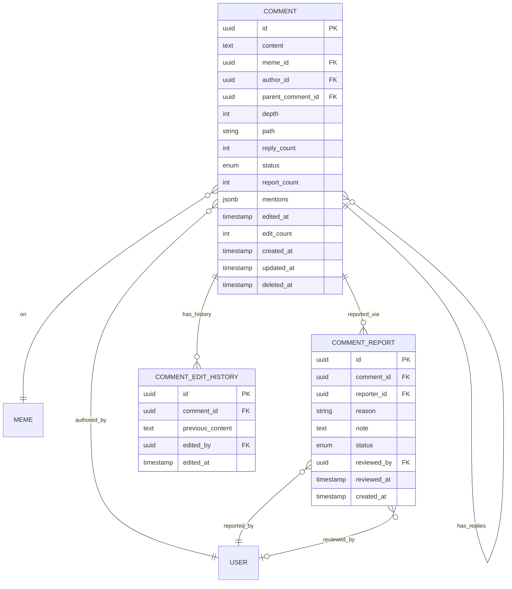

# Feature Specification: Comments

## Feature Overview

### Purpose & Scope

The Comments feature enables users to engage in discussions around memes through threaded conversations. This feature supports community building, content feedback, and user engagement through text-based interactions.

**Business Objective**: Foster community engagement and increase user retention through meaningful conversations around meme content.

**Manufacturing Impact**: This is a feedback and communication system that enables collaborative quality improvement and knowledge sharing, similar to production notes and improvement suggestions in manufacturing processes.

### Functional Boundaries

#### In Scope

- Comment creation on memes
- Comment editing and deletion
- Threaded/nested comments (replies)
- Comment moderation
- Comment reactions (optional)
- Comment sorting and filtering
- Comment pagination
- User mention support (@username)
- Comment reporting
- Soft deletion with audit trail
- Comment count per meme

#### Out of Scope

- Comment likes/votes (separate feature)
- Rich text formatting (Phase 2)
- Media attachments in comments (Phase 2)
- Comment translation (future)
- Real-time comment updates (WebSocket - Phase 2)
- Comment notifications (separate feature)
- Private messaging
- Comment templates

### Success Metrics

- Comments per meme (average)
- Comment engagement rate
- Reply depth distribution
- Active commenters per day
- Average comment length
- Comment moderation rate
- Comment API response time < 200ms

---

## Functional Requirements

### FR-1: Create Comment

**Priority**: Critical

**Description**: Authenticated users must be able to comment on public memes.

**Acceptance Criteria**:

```gherkin
Given an authenticated user
And a public meme exists
When the user submits a comment
  With content text
Then a new comment is created
  And the comment is associated with the meme
  And the comment is associated with the user
  And the meme's comment count is incremented
  And the comment ID is returned
```

**Business Rules**:

- Authenticated users only
- Content is required (3-2000 characters)
- Comments on private memes only by meme owner
- Cannot comment on deleted memes
- Maximum 1 comment per minute per user (rate limit)
- Profanity filter applied
- Auto-moderation for spam

**Data Requirements**:

```typescript
interface CreateCommentDto {
  content: string;                   // Required, 3-2000 characters
  parentCommentId?: string;          // Optional, for replies
}

interface CommentResponse {
  id: string;
  content: string;
  meme: {
    id: string;
    title: string;
    slug: string;
  };
  author: {
    id: string;
    email: string;
    firstName?: string;
    lastName?: string;
  };
  parentComment?: {
    id: string;
    author: {
      email: string;
    };
  };
  replyCount: number;
  depth: number;                     // Nesting level (0 = root)
  status: 'ACTIVE' | 'EDITED' | 'DELETED' | 'HIDDEN';
  createdAt: Date;
  updatedAt: Date;
  editedAt?: Date;
}
```

### FR-2: Create Reply (Nested Comment)

**Priority**: High

**Description**: Users must be able to reply to existing comments, creating threaded discussions.

**Acceptance Criteria**:

```gherkin
Given an authenticated user
And a comment exists
When the user replies to the comment
  With content text and parent comment ID
Then a new reply is created
  And the reply is linked to the parent comment
  And the parent's reply count is incremented
  And the reply depth is calculated
  And nested replies are limited to maximum depth
```

**Business Rules**:

- Maximum nesting depth: 5 levels
- Replies inherit meme context from parent
- Cannot reply to deleted comments
- Cannot reply to hidden comments
- Reply depth displayed visually in UI

### FR-3: Edit Comment

**Priority**: High

**Description**: Users must be able to edit their own comments within a time window.

**Acceptance Criteria**:

```gherkin
Given an authenticated user owns a comment
And the comment was created within edit window (24 hours)
When the user edits the comment content
Then the comment content is updated
  And the comment status is marked as EDITED
  And the editedAt timestamp is recorded
  And edit history is maintained (optional)
```

**Business Rules**:

- Only author can edit their comment
- Admins can edit any comment
- Edit window: 24 hours after creation
- After edit window, only admins can edit
- Edited comments show "edited" indicator
- Original content preserved in edit history (optional)

### FR-4: Delete Comment

**Priority**: High

**Description**: Users must be able to delete their own comments.

**Acceptance Criteria**:

```gherkin
Given an authenticated user owns a comment
When the user deletes the comment
Then the comment is soft-deleted
  And the comment content is replaced with placeholder
  And the comment status is marked as DELETED
  And replies are preserved with context
  And the meme's comment count is decremented
```

**Business Rules**:

- Only author or admin can delete
- Soft deletion (preserve structure for replies)
- Deleted comments show "[deleted]" placeholder
- Replies remain visible with context
- Hard deletion only by admin (cascade deletes replies)

### FR-5: Get Meme Comments

**Priority**: Critical

**Description**: Users must be able to retrieve comments for a meme with pagination and sorting.

**Acceptance Criteria**:

```gherkin
Given a meme has comments
When a user requests meme comments
Then comments are returned with pagination
  And comments are sorted by criteria
  And nested replies are included or loaded separately
  And deleted comments show placeholder
  And hidden comments are excluded
```

**Sort Options**:

- `newest` - Most recent first (default)
- `oldest` - Oldest first
- `popular` - Most replies first
- `author` - Group by author

**Loading Strategies**:

1. **Flat Loading**: All comments paginated, depth indicated
2. **Nested Loading**: Root comments with nested replies
3. **Lazy Loading**: Root comments, replies loaded on demand

### FR-6: Get Comment Replies

**Priority**: High

**Description**: Users must be able to load replies to a specific comment.

**Acceptance Criteria**:

```gherkin
Given a comment has replies
When a user requests comment replies
Then direct child replies are returned
  And replies are paginated
  And replies are sorted by creation time
  And nested depth is preserved
```

### FR-7: Report Comment

**Priority**: Medium

**Description**: Users must be able to report inappropriate comments.

**Acceptance Criteria**:

```gherkin
Given an authenticated user
And a comment exists
When the user reports the comment
  With a reason
Then a report is created
  And the comment is flagged for moderation
  And moderators are notified
  And high report count auto-hides comment
```

**Report Reasons**:

- `SPAM` - Spam or promotional content
- `HARASSMENT` - Harassment or bullying
- `HATE_SPEECH` - Hate speech or discrimination
- `INAPPROPRIATE` - Inappropriate or offensive
- `OFF_TOPIC` - Off-topic or irrelevant
- `OTHER` - Other reason

### FR-8: User Mentions

**Priority**: Medium

**Description**: Users must be able to mention other users in comments using @username.

**Acceptance Criteria**:

```gherkin
Given a user writes a comment
When the user includes @username in content
Then the mentioned user is detected
  And the mention is parsed and linked
  And the mentioned user receives notification (optional)
  And mentions are clickable in UI
```

**Mention Rules**:

- Format: `@username` or `@user.name`
- Maximum 5 mentions per comment
- Mentioned users must exist
- Cannot mention yourself
- Mentions work in replies

---

## Non-Functional Requirements

### Performance Requirements

| Operation           | Target Response Time | Maximum Load         |
| ------------------- | -------------------- | -------------------- |
| Create Comment      | < 200ms              | 100 req/min per user |
| Get Meme Comments   | < 250ms              | 1000 req/min         |
| Get Comment Replies | < 150ms              | 500 req/min          |
| Edit Comment        | < 150ms              | 20 req/min per user  |
| Delete Comment      | < 150ms              | 10 req/min per user  |
| Report Comment      | < 200ms              | 5 req/min per user   |

### Security Requirements

- **Authentication**: All comment operations require JWT
- **Authorization**: Users can only edit/delete their own comments
- **Input Validation**: Content sanitized for XSS prevention
- **Rate Limiting**:
  - Max 10 comments per minute per user
  - Max 5 edits per hour per user
- **Profanity Filter**: Automatic content filtering
- **Spam Detection**: Pattern-based spam detection

### Data Integrity

- **Foreign Key Constraints**: User, meme, parent comment references
- **Cascade Rules**: Preserve structure on soft delete
- **Unique Constraints**: None (multiple comments allowed)
- **Transaction Support**: Atomic comment operations
- **Referential Integrity**: Comments linked to valid memes

### Scalability Requirements

- Support 1M+ comments in database
- Handle 5,000+ concurrent commenters
- Efficient threaded comment retrieval
- Database indexing on meme_id, author_id, parent_id
- Cache popular meme comment trees
- Pagination for large comment threads

---

## Database Schema

### Comment Entity

```sql
CREATE TABLE comments (
  id UUID PRIMARY KEY DEFAULT gen_random_uuid(),

  -- Content
  content TEXT NOT NULL,

  -- Relationships
  meme_id UUID NOT NULL REFERENCES memes(id) ON DELETE CASCADE,
  author_id UUID NOT NULL REFERENCES users(id) ON DELETE SET NULL,
  parent_comment_id UUID REFERENCES comments(id) ON DELETE CASCADE,

  -- Threading
  depth INTEGER DEFAULT 0,           -- Nesting level
  path TEXT,                         -- Materialized path (e.g., '1/5/12')
  reply_count INTEGER DEFAULT 0,

  -- Moderation
  status VARCHAR(20) DEFAULT 'ACTIVE',
  report_count INTEGER DEFAULT 0,

  -- Mentions
  mentions JSONB,                    -- Array of mentioned user IDs

  -- Edit tracking
  edited_at TIMESTAMP,
  edit_count INTEGER DEFAULT 0,

  -- Timestamps
  created_at TIMESTAMP DEFAULT CURRENT_TIMESTAMP,
  updated_at TIMESTAMP DEFAULT CURRENT_TIMESTAMP,
  deleted_at TIMESTAMP,

  -- Indexes
  INDEX idx_comments_meme (meme_id),
  INDEX idx_comments_author (author_id),
  INDEX idx_comments_parent (parent_comment_id),
  INDEX idx_comments_status (status),
  INDEX idx_comments_created_at (created_at DESC),
  INDEX idx_comments_path (path),
  INDEX idx_comments_depth (depth),

  -- Full-text search
  INDEX idx_comments_content USING gin(to_tsvector('english', content)),

  -- Constraints
  CONSTRAINT chk_status CHECK (status IN ('ACTIVE', 'EDITED', 'DELETED', 'HIDDEN')),
  CONSTRAINT chk_depth CHECK (depth >= 0 AND depth <= 5),
  CONSTRAINT chk_content_length CHECK (LENGTH(content) >= 3 AND LENGTH(content) <= 2000)
);

-- Comment Reports
CREATE TABLE comment_reports (
  id UUID PRIMARY KEY DEFAULT gen_random_uuid(),
  comment_id UUID NOT NULL REFERENCES comments(id) ON DELETE CASCADE,
  reporter_id UUID NOT NULL REFERENCES users(id) ON DELETE CASCADE,
  reason VARCHAR(50) NOT NULL,
  note TEXT,
  status VARCHAR(20) DEFAULT 'PENDING',
  reviewed_by UUID REFERENCES users(id),
  reviewed_at TIMESTAMP,
  created_at TIMESTAMP DEFAULT CURRENT_TIMESTAMP,

  -- Indexes
  INDEX idx_comment_reports_comment (comment_id),
  INDEX idx_comment_reports_reporter (reporter_id),
  INDEX idx_comment_reports_status (status),

  -- One report per user per comment
  CONSTRAINT uk_reporter_comment UNIQUE (reporter_id, comment_id),

  CONSTRAINT chk_report_status CHECK (status IN ('PENDING', 'REVIEWED', 'RESOLVED', 'DISMISSED'))
);

-- Comment Edit History (optional)
CREATE TABLE comment_edit_history (
  id UUID PRIMARY KEY DEFAULT gen_random_uuid(),
  comment_id UUID NOT NULL REFERENCES comments(id) ON DELETE CASCADE,
  previous_content TEXT NOT NULL,
  edited_by UUID NOT NULL REFERENCES users(id),
  edited_at TIMESTAMP DEFAULT CURRENT_TIMESTAMP,

  INDEX idx_edit_history_comment (comment_id),
  INDEX idx_edit_history_edited_at (edited_at DESC)
);

-- Add comment count to memes table
ALTER TABLE memes ADD COLUMN comment_count INTEGER DEFAULT 0;
CREATE INDEX idx_memes_comment_count ON memes(comment_count DESC);

-- Trigger to update comment counts
CREATE OR REPLACE FUNCTION update_meme_comment_count()
RETURNS TRIGGER AS $$
BEGIN
  IF TG_OP = 'INSERT' THEN
    UPDATE memes SET comment_count = comment_count + 1 WHERE id = NEW.meme_id;
    RETURN NEW;
  ELSIF TG_OP = 'DELETE' AND OLD.deleted_at IS NULL THEN
    UPDATE memes SET comment_count = comment_count - 1 WHERE id = OLD.meme_id;
    RETURN OLD;
  ELSIF TG_OP = 'UPDATE' AND NEW.deleted_at IS NOT NULL AND OLD.deleted_at IS NULL THEN
    UPDATE memes SET comment_count = comment_count - 1 WHERE id = NEW.meme_id;
    RETURN NEW;
  END IF;
  RETURN NULL;
END;
$$ LANGUAGE plpgsql;

CREATE TRIGGER trigger_update_comment_count
AFTER INSERT OR UPDATE OR DELETE ON comments
FOR EACH ROW EXECUTE FUNCTION update_meme_comment_count();

-- Trigger to update reply counts
CREATE OR REPLACE FUNCTION update_comment_reply_count()
RETURNS TRIGGER AS $$
BEGIN
  IF TG_OP = 'INSERT' AND NEW.parent_comment_id IS NOT NULL THEN
    UPDATE comments SET reply_count = reply_count + 1 WHERE id = NEW.parent_comment_id;
    RETURN NEW;
  ELSIF TG_OP = 'DELETE' AND OLD.parent_comment_id IS NOT NULL AND OLD.deleted_at IS NULL THEN
    UPDATE comments SET reply_count = reply_count - 1 WHERE id = OLD.parent_comment_id;
    RETURN OLD;
  END IF;
  RETURN NULL;
END;
$$ LANGUAGE plpgsql;

CREATE TRIGGER trigger_update_reply_count
AFTER INSERT OR DELETE ON comments
FOR EACH ROW EXECUTE FUNCTION update_comment_reply_count();
```

### Relationships



---

## API Endpoints

### Create Comment

```http
POST /v1/memes/:memeId/comments
Authorization: Bearer <token>
Content-Type: application/json

Request Body:
{
  "content": "This is hilarious! 😂"
}

Response 201 Created:
{
  "success": true,
  "message": "Comment created successfully",
  "data": {
    "id": "comment-uuid",
    "content": "This is hilarious! 😂",
    "meme": {
      "id": "meme-uuid",
      "title": "Funny Cat Meme",
      "slug": "funny-cat-meme"
    },
    "author": {
      "id": "user-uuid",
      "email": "user@example.com",
      "firstName": "John",
      "lastName": "Doe"
    },
    "depth": 0,
    "replyCount": 0,
    "status": "ACTIVE",
    "createdAt": "2025-11-07T10:00:00Z",
    "updatedAt": "2025-11-07T10:00:00Z"
  }
}
```

### Create Reply

```http
POST /v1/memes/:memeId/comments
Authorization: Bearer <token>
Content-Type: application/json

Request Body:
{
  "content": "I totally agree! @john.doe check this out",
  "parentCommentId": "parent-comment-uuid"
}

Response 201 Created:
{
  "success": true,
  "message": "Reply created successfully",
  "data": {
    "id": "reply-uuid",
    "content": "I totally agree! @john.doe check this out",
    "meme": {
      "id": "meme-uuid",
      "title": "Funny Cat Meme"
    },
    "author": {
      "id": "user-uuid-2",
      "email": "user2@example.com"
    },
    "parentComment": {
      "id": "parent-comment-uuid",
      "author": {
        "email": "user@example.com"
      }
    },
    "depth": 1,
    "replyCount": 0,
    "mentions": [
      {
        "userId": "user-uuid",
        "username": "john.doe"
      }
    ],
    "status": "ACTIVE",
    "createdAt": "2025-11-07T10:05:00Z"
  }
}
```

### Get Meme Comments (Flat Structure)

```http
GET /v1/memes/:memeId/comments?page=1&limit=20&sort=newest
Authorization: Optional

Response 200 OK:
{
  "success": true,
  "message": "Comments fetched successfully",
  "data": [
    {
      "id": "comment-uuid",
      "content": "This is hilarious! 😂",
      "author": {
        "id": "user-uuid",
        "email": "user@example.com",
        "firstName": "John"
      },
      "depth": 0,
      "replyCount": 3,
      "status": "ACTIVE",
      "createdAt": "2025-11-07T10:00:00Z"
    },
    {
      "id": "reply-uuid",
      "content": "I totally agree!",
      "author": {
        "id": "user-uuid-2",
        "email": "user2@example.com"
      },
      "parentComment": {
        "id": "comment-uuid",
        "author": { "email": "user@example.com" }
      },
      "depth": 1,
      "replyCount": 0,
      "status": "ACTIVE",
      "createdAt": "2025-11-07T10:05:00Z"
    }
  ],
  "meta": {
    "page": 1,
    "limit": 20,
    "total": 45,
    "totalPages": 3,
    "totalComments": 45,
    "totalRootComments": 12
  }
}
```

### Get Meme Comments (Nested Structure)

```http
GET /v1/memes/:memeId/comments/tree?limit=20
Authorization: Optional

Response 200 OK:
{
  "success": true,
  "message": "Comment tree fetched successfully",
  "data": [
    {
      "id": "comment-uuid",
      "content": "This is hilarious! 😂",
      "author": {
        "id": "user-uuid",
        "email": "user@example.com"
      },
      "depth": 0,
      "replyCount": 3,
      "replies": [
        {
          "id": "reply-uuid-1",
          "content": "I agree!",
          "author": {
            "id": "user-uuid-2",
            "email": "user2@example.com"
          },
          "depth": 1,
          "replyCount": 1,
          "replies": [
            {
              "id": "reply-uuid-2",
              "content": "Me too!",
              "author": {
                "id": "user-uuid-3",
                "email": "user3@example.com"
              },
              "depth": 2,
              "replyCount": 0,
              "replies": [],
              "createdAt": "2025-11-07T10:15:00Z"
            }
          ],
          "createdAt": "2025-11-07T10:10:00Z"
        }
      ],
      "createdAt": "2025-11-07T10:00:00Z"
    }
  ],
  "meta": {
    "totalRootComments": 12,
    "maxDepth": 5
  }
}
```

### Get Comment Replies

```http
GET /v1/comments/:commentId/replies?page=1&limit=10
Authorization: Optional

Response 200 OK:
{
  "success": true,
  "message": "Replies fetched successfully",
  "data": [
    {
      "id": "reply-uuid",
      "content": "Great point!",
      "author": {
        "id": "user-uuid",
        "email": "user@example.com"
      },
      "parentComment": {
        "id": "comment-uuid"
      },
      "depth": 1,
      "replyCount": 0,
      "createdAt": "2025-11-07T10:10:00Z"
    }
  ],
  "meta": {
    "page": 1,
    "limit": 10,
    "total": 5,
    "totalPages": 1
  }
}
```

### Edit Comment

```http
PATCH /v1/comments/:commentId
Authorization: Bearer <token>
Content-Type: application/json

Request Body:
{
  "content": "This is hilarious! 😂 (edited for clarity)"
}

Response 200 OK:
{
  "success": true,
  "message": "Comment updated successfully",
  "data": {
    "id": "comment-uuid",
    "content": "This is hilarious! 😂 (edited for clarity)",
    "status": "EDITED",
    "editedAt": "2025-11-07T11:00:00Z",
    "editCount": 1,
    "updatedAt": "2025-11-07T11:00:00Z"
  }
}
```

### Delete Comment

```http
DELETE /v1/comments/:commentId
Authorization: Bearer <token>

Response 200 OK:
{
  "success": true,
  "message": "Comment deleted successfully"
}
```

### Report Comment

```http
POST /v1/comments/:commentId/report
Authorization: Bearer <token>
Content-Type: application/json

Request Body:
{
  "reason": "SPAM",
  "note": "This comment is promotional spam"
}

Response 201 Created:
{
  "success": true,
  "message": "Comment reported successfully",
  "data": {
    "id": "report-uuid",
    "comment": {
      "id": "comment-uuid"
    },
    "reason": "SPAM",
    "note": "This comment is promotional spam",
    "status": "PENDING",
    "createdAt": "2025-11-07T12:00:00Z"
  }
}
```

### Get User's Comments

```http
GET /v1/users/me/comments?page=1&limit=20
Authorization: Bearer <token>

Response 200 OK:
{
  "success": true,
  "message": "User comments fetched successfully",
  "data": [
    {
      "id": "comment-uuid",
      "content": "This is hilarious!",
      "meme": {
        "id": "meme-uuid",
        "title": "Funny Cat Meme",
        "slug": "funny-cat-meme"
      },
      "replyCount": 3,
      "createdAt": "2025-11-07T10:00:00Z"
    }
  ],
  "meta": {
    "page": 1,
    "limit": 20,
    "total": 156,
    "totalPages": 8
  }
}
```

---

## Business Logic & Rules

### Depth Calculation and Path

```typescript
async function calculateCommentDepthAndPath(
  parentCommentId: string | null
): Promise<{ depth: number; path: string }> {
  if (!parentCommentId) {
    return { depth: 0, path: '' };
  }

  const parent = await commentsRepository.findById(parentCommentId);

  if (!parent) {
    throw new NotFoundException('Parent comment not found');
  }

  const depth = parent.depth + 1;

  if (depth > 5) {
    throw new ValidationException('Maximum nesting depth (5) exceeded');
  }

  const path = parent.path
    ? `${parent.path}/${parent.id}`
    : parent.id;

  return { depth, path };
}
```

### Mention Parsing

```typescript
interface Mention {
  userId: string;
  username: string;
  startIndex: number;
  endIndex: number;
}

async function parseMentions(content: string): Promise<Mention[]> {
  // Regex to match @username or @user.name
  const mentionRegex = /@([a-zA-Z0-9._-]+)/g;
  const mentions: Mention[] = [];
  let match;

  while ((match = mentionRegex.exec(content)) !== null) {
    const username = match[1];

    // Find user by username/email
    const user = await usersRepository.findByUsername(username);

    if (user) {
      mentions.push({
        userId: user.id,
        username: username,
        startIndex: match.index,
        endIndex: match.index + match[0].length
      });
    }
  }

  // Limit mentions
  if (mentions.length > 5) {
    throw new ValidationException('Maximum 5 mentions allowed per comment');
  }

  return mentions;
}
```

### Edit Window Validation

```typescript
function canEditComment(comment: Comment, user: User): boolean {
  // Admins can always edit
  if (user.role === 'ADMIN') {
    return true;
  }

  // Must be comment author
  if (comment.authorId !== user.id) {
    return false;
  }

  // Check edit window (24 hours)
  const now = new Date();
  const createdAt = new Date(comment.createdAt);
  const hoursSinceCreation = (now.getTime() - createdAt.getTime()) / (1000 * 60 * 60);

  return hoursSinceCreation <= 24;
}
```

### Content Moderation

```typescript
async function moderateCommentContent(content: string): Promise<ModerationResult> {
  // Profanity filter
  const profanityResult = await profanityFilter.check(content);

  if (profanityResult.hasProfanity) {
    return {
      allowed: false,
      reason: 'PROFANITY_DETECTED',
      filteredContent: profanityResult.filtered
    };
  }

  // Spam detection
  const spamScore = await spamDetector.analyze(content);

  if (spamScore > 0.8) {
    return {
      allowed: false,
      reason: 'SPAM_DETECTED',
      score: spamScore
    };
  }

  // URL check (limit links)
  const urlCount = (content.match(/https?:\/\//g) || []).length;

  if (urlCount > 2) {
    return {
      allowed: false,
      reason: 'TOO_MANY_URLS',
      urlCount
    };
  }

  return {
    allowed: true,
    content
  };
}
```

### Load Comment Tree (Recursive)

```typescript
interface CommentTree extends Comment {
  replies: CommentTree[];
}

async function loadCommentTree(
  memeId: string,
  maxDepth: number = 5
): Promise<CommentTree[]> {
  // Get all root comments
  const rootComments = await commentsRepository.find({
    where: {
      memeId,
      parentCommentId: IsNull(),
      status: In(['ACTIVE', 'EDITED']),
      deletedAt: IsNull()
    },
    order: {
      createdAt: 'DESC'
    }
  });

  // Recursively load replies
  async function loadReplies(
    comment: Comment,
    currentDepth: number
  ): Promise<CommentTree> {
    if (currentDepth >= maxDepth) {
      return { ...comment, replies: [] };
    }

    const replies = await commentsRepository.find({
      where: {
        parentCommentId: comment.id,
        status: In(['ACTIVE', 'EDITED']),
        deletedAt: IsNull()
      },
      order: {
        createdAt: 'ASC'
      }
    });

    const repliesWithChildren = await Promise.all(
      replies.map(reply => loadReplies(reply, currentDepth + 1))
    );

    return {
      ...comment,
      replies: repliesWithChildren
    };
  }

  return await Promise.all(
    rootComments.map(comment => loadReplies(comment, 0))
  );
}

// Optimized version using single query with path
async function loadCommentTreeOptimized(
  memeId: string,
  maxDepth: number = 5
): Promise<CommentTree[]> {
  // Get all comments for meme in single query
  const allComments = await commentsRepository
    .createQueryBuilder('comment')
    .where('comment.meme_id = :memeId', { memeId })
    .andWhere('comment.status IN (:...statuses)', { statuses: ['ACTIVE', 'EDITED'] })
    .andWhere('comment.deleted_at IS NULL')
    .andWhere('comment.depth <= :maxDepth', { maxDepth })
    .orderBy('comment.path', 'ASC')
    .addOrderBy('comment.created_at', 'ASC')
    .getMany();

  // Build tree structure
  const commentMap = new Map<string, CommentTree>();
  const rootComments: CommentTree[] = [];

  for (const comment of allComments) {
    const commentTree: CommentTree = {
      ...comment,
      replies: []
    };

    commentMap.set(comment.id, commentTree);

    if (!comment.parentCommentId) {
      rootComments.push(commentTree);
    } else {
      const parent = commentMap.get(comment.parentCommentId);
      if (parent) {
        parent.replies.push(commentTree);
      }
    }
  }

  return rootComments;
}
```

### Report Threshold Auto-Hide

```typescript
async function checkCommentReportThreshold(commentId: string): Promise<void> {
  const comment = await commentsRepository.findById(commentId);

  const REPORT_THRESHOLD = 3;
  const HIGH_REPORT_THRESHOLD = 5;

  if (comment.reportCount >= HIGH_REPORT_THRESHOLD) {
    // Auto-hide comment
    await commentsRepository.update(commentId, {
      status: 'HIDDEN'
    });

    // Notify moderators
    await notificationService.notifyModerators({
      type: 'COMMENT_AUTO_HIDDEN',
      commentId,
      reportCount: comment.reportCount
    });
  } else if (comment.reportCount >= REPORT_THRESHOLD) {
    // Flag for review
    await moderationQueue.add({
      type: 'COMMENT_REVIEW',
      commentId,
      priority: 'HIGH'
    });
  }
}
```

---

## Integration Points

### Dependencies

- **Memes Module**: Target content for comments
- **Users Module**: Comment authors
- **Moderation Module**: Content filtering and reporting
- **Notification Module**: Mention notifications

### External Integrations

- **Profanity Filter Service**: Content moderation
- **Spam Detection Service**: Spam identification
- **Notification Service**: User mentions
- **Analytics Service**: Comment engagement tracking

---

## Testing Strategy

### Unit Tests

- Depth calculation
- Path generation
- Mention parsing
- Edit window validation
- Content moderation
- Tree building algorithms

### Integration Tests

- Create comment and replies
- Edit and delete comments
- Report comments
- Load comment trees
- Count updates
- Mention notifications

### E2E Tests

- Complete commenting workflow
- Threaded conversation
- Moderation flow
- Mention functionality
- Report and hide comments

---

## Monitoring & Logging

### Key Metrics

- Comments per meme (average)
- Reply depth distribution
- Edit rate
- Delete rate
- Report rate
- Mention usage
- API response times

### Alerts

- High report count on comment
- Spam detection rate spike
- API latency > 300ms
- Database query slow performance

---

## Future Enhancements

### Phase 2

- Rich text formatting (Markdown, bold, italic)
- Media attachments (images, GIFs)
- Comment reactions (like, love, laugh)
- Real-time updates (WebSocket)
- Comment notifications
- Comment search

### Phase 3

- Comment voting system
- Best comment highlighting
- Verified user badges
- Comment translation
- Voice comments
- Comment analytics dashboard

---

## Changelog

| Version | Date       | Changes                       |
| ------- | ---------- | ----------------------------- |
| 1.0.0   | 2025-11-07 | Initial feature specification |
