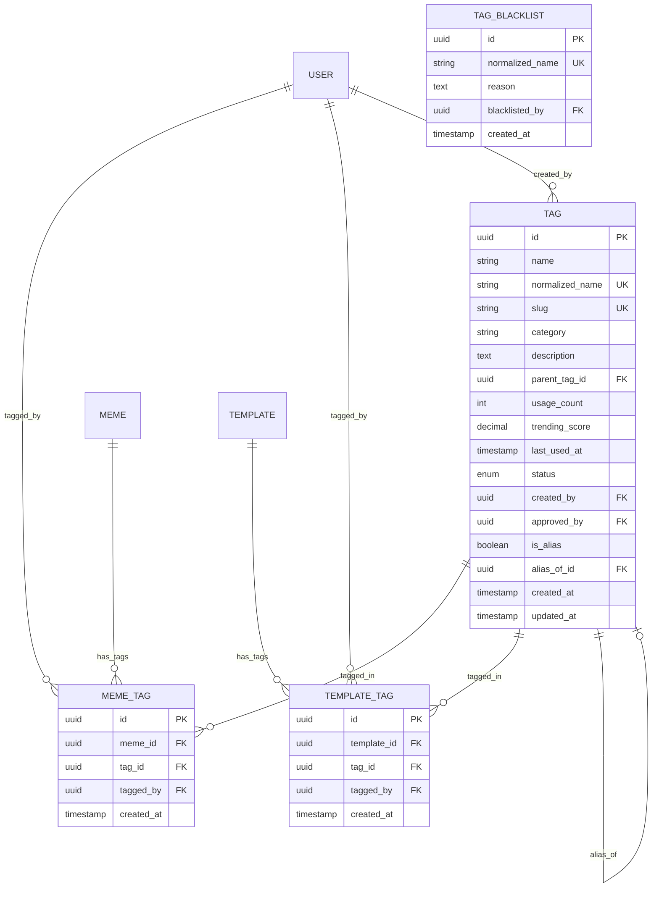

# Feature Specification: Enhanced Meme Tags

## Feature Overview

### Purpose & Scope

The Enhanced Meme Tags feature provides a dynamic, flexible tagging system for memes and meme templates. This system enables content organization, discovery, and categorization through user-generated and system-managed tags with automatic tag creation capabilities.

**Business Objective**: Improve content discoverability and user engagement through flexible, community-driven tagging while maintaining content quality through tag moderation.

**Manufacturing Impact**: This is analogous to dynamic work order classification and product categorization systems in manufacturing, where items can be tagged with multiple attributes for better tracking, sorting, and retrieval.

### Functional Boundaries

#### In Scope

- Dynamic tag creation (auto-create when tagging content)
- Many-to-many relationships (tags ↔ memes, tags ↔ templates)
- Tag normalization and deduplication
- Tag popularity tracking
- Tag suggestions and autocomplete
- Tag merging and aliasing
- Tag moderation and approval
- Tag hierarchies (parent-child relationships)
- Tag trending calculation
- Tag blacklisting
- Bulk tag operations

#### Out of Scope

- Tag translations (Phase 2)
- Tag analytics dashboard (separate feature)
- Tag-based content recommendation (ML - Phase 3)
- Tag voting/rating (Phase 2)
- Custom tag icons (Phase 2)
- Tag ownership (community tags)

### Success Metrics

- Tags per meme (average)
- Tag reuse rate
- Tag creation rate
- Tag search usage
- Content discovery via tags
- Tag normalization effectiveness

---

## Functional Requirements

### FR-1: Dynamic Tag Creation

**Priority**: Critical

**Description**: When tagging a meme or template, if the tag doesn't exist, it must be created automatically.

**Acceptance Criteria**:

```gherkin
Given a user is tagging a meme or template
And the tag "funny cat" does not exist
When the user adds the tag "funny cat"
Then a new tag is created with normalized name
  And the tag is associated with the content
  And the tag status is set based on user role
  And the tag is available for future use
```

**Business Rules**:

- Tag names normalized: lowercase, trimmed, special chars removed
- Duplicate check using normalized name
- Auto-approve tags from trusted users
- New tags from regular users pending approval
- Maximum 20 tags per content item
- Tag name: 2-50 characters

**Data Requirements**:

```typescript
interface CreateTagDto {
  name: string;                      // Original name
  category?: string;                 // Optional category
}

interface TagDto {
  id: string;
  name: string;                      // Original name
  normalizedName: string;            // Lowercase, cleaned
  slug: string;                      // URL-friendly
  category?: string;
  description?: string;
  usageCount: number;
  status: 'ACTIVE' | 'PENDING' | 'REJECTED' | 'BLACKLISTED';
  createdBy?: string;
  createdAt: Date;
  updatedAt: Date;
}
```

### FR-2: Tag Normalization & Deduplication

**Priority**: Critical

**Description**: Tags must be normalized to prevent duplicates (e.g., "Funny Cat", "funny-cat", "FUNNY CAT" → "funny cat").

**Acceptance Criteria**:

```gherkin
Given multiple users create similar tags
When tag normalization is applied
Then duplicate tags are prevented
  And existing normalized tags are reused
  And tag variations are merged
  And usage counts are consolidated
```

**Normalization Rules**:

1. Convert to lowercase
2. Trim whitespace
3. Remove special characters except hyphens and underscores
4. Replace multiple spaces with single space
5. Remove leading/trailing special characters
6. Replace underscores with spaces
7. Remove duplicate words

```typescript
function normalizeTagName(name: string): string {
  return name
    .toLowerCase()
    .trim()
    .replace(/[^\w\s-]/g, '')        // Remove special chars except - and _
    .replace(/_/g, ' ')               // Replace underscores with spaces
    .replace(/\s+/g, ' ')             // Multiple spaces → single space
    .replace(/^-+|-+$/g, '')          // Remove leading/trailing hyphens
    .trim();
}

// Examples:
// "Funny Cat" → "funny cat"
// "FUNNY-CAT" → "funny-cat"
// "Funny  Cat!!!" → "funny cat"
// "funny_cat" → "funny cat"
```

### FR-3: Many-to-Many Tag Associations

**Priority**: Critical

**Description**: Tags must support many-to-many relationships with both memes and templates.

**Acceptance Criteria**:

```gherkin
Given a tag exists
When the tag is applied to multiple memes and templates
Then the tag is associated with all content items
  And each content item can have multiple tags
  And associations are tracked with timestamps
  And usage counts are updated
```

**Business Rules**:

- Maximum 20 tags per meme
- Maximum 30 tags per template
- Cannot add duplicate tags to same content
- Removing tag doesn't delete tag (preserves for other content)
- Deleting content removes tag associations

### FR-4: Tag Search & Autocomplete

**Priority**: High

**Description**: Users must be able to search tags and get autocomplete suggestions when tagging content.

**Acceptance Criteria**:

```gherkin
Given a user is typing a tag name
When the user enters partial text
Then matching tags are suggested
  And suggestions are sorted by popularity
  And maximum 10 suggestions are shown
  And newly created tags appear in results
```

**Search Features**:

- Prefix search (starts with)
- Fuzzy search (similar names)
- Full-text search
- Sort by popularity (usage count)
- Filter by category
- Show tag usage count

### FR-5: Tag Merging & Aliasing

**Priority**: Medium

**Description**: Admins must be able to merge duplicate or similar tags and create aliases.

**Acceptance Criteria**:

```gherkin
Given an admin identifies duplicate tags
When the admin merges "funny-cat" into "funny cat"
Then all associations are transferred to primary tag
  And usage counts are consolidated
  And merged tag is marked as alias
  And searches for alias redirect to primary tag
```

**Merge Rules**:

- Only admins can merge tags
- Primary tag retains all data
- Merged tag becomes alias
- All content associations transferred
- Usage counts summed
- Audit trail maintained

### FR-6: Tag Hierarchies (Parent-Child)

**Priority**: Medium

**Description**: Tags must support parent-child relationships for organized taxonomies.

**Acceptance Criteria**:

```gherkin
Given a tag hierarchy exists (Animals → Cats → Funny Cats)
When a user tags content with "Funny Cats"
Then the content is associated with child tag
  And optionally associated with parent tags
  And hierarchy is visible in UI
  And filtering by parent includes children
```

**Hierarchy Rules**:

- Maximum 3 levels deep
- One parent per tag
- Multiple children allowed
- Circular references prevented
- Orphan tags allowed (no parent)

### FR-7: Tag Trending & Popularity

**Priority**: Medium

**Description**: System must calculate trending tags based on recent usage.

**Acceptance Criteria**:

```gherkin
Given tags are used over time
When trending calculation runs
Then tags with recent usage spikes are marked trending
  And trending score decays over time
  And trending tags are highlighted in UI
  And trending period is configurable (24h, 7d, 30d)
```

**Trending Algorithm**:

```typescript
function calculateTrendingScore(tag: Tag): number {
  const now = Date.now();
  const oneDayMs = 24 * 60 * 60 * 1000;

  // Get recent usage (last 7 days)
  const recentUsage = tag.associations.filter(assoc => {
    const age = now - assoc.createdAt.getTime();
    return age < 7 * oneDayMs;
  });

  // Calculate time-weighted score
  const score = recentUsage.reduce((sum, assoc) => {
    const ageDays = (now - assoc.createdAt.getTime()) / oneDayMs;
    const decayFactor = Math.exp(-ageDays / 3); // 3-day half-life
    return sum + decayFactor;
  }, 0);

  // Compare to historical average
  const historicalAvg = tag.usageCount / tag.daysSinceCreation;
  const trendingMultiplier = score / Math.max(historicalAvg, 1);

  return score * trendingMultiplier;
}
```

### FR-8: Tag Moderation

**Priority**: High

**Description**: New tags from regular users must be moderated before becoming active.

**Acceptance Criteria**:

```gherkin
Given a regular user creates a new tag
When the tag is created
Then the tag status is set to PENDING
  And moderators are notified
  And the tag is visible to creator but not others
  And moderators can approve or reject
```

**Moderation Rules**:

- Admins and moderators auto-approve
- Regular users require approval
- Rejected tags cannot be recreated (blacklisted)
- Approval queue sorted by creation date
- Bulk approve/reject operations

### FR-9: Tag Blacklisting

**Priority**: Medium

**Description**: Inappropriate or spam tags must be blacklistable to prevent reuse.

**Acceptance Criteria**:

```gherkin
Given a tag is inappropriate
When a moderator blacklists the tag
Then the tag status is set to BLACKLISTED
  And the tag is removed from all content
  And the tag name cannot be recreated
  And variations are also blocked
```

---

## Non-Functional Requirements

### Performance Requirements

| Operation               | Target Response Time | Maximum Load |
| ----------------------- | -------------------- | ------------ |
| Tag Search/Autocomplete | < 100ms              | 1000 req/min |
| Create Tag              | < 150ms              | 200 req/min  |
| Tag Content             | < 200ms              | 500 req/min  |
| Get Content Tags        | < 100ms              | 1000 req/min |
| Tag Trending Calc       | < 5s (batch)         | Every 15 min |

### Security Requirements

- **Authentication**: Tag creation requires JWT
- **Authorization**: Only admins can merge/blacklist tags
- **Input Validation**: Tag names sanitized for XSS
- **Rate Limiting**: Max 50 tag operations per minute per user
- **Spam Prevention**: Detect rapid tag creation patterns

### Data Integrity

- **Unique Constraints**: Normalized tag names must be unique
- **Foreign Key Constraints**: Tag associations reference valid content
- **Cascade Rules**: Deleting content removes tag associations
- **Transaction Support**: Tag creation and association atomic

### Scalability Requirements

- Support 100,000+ tags
- Handle 1M+ tag associations
- Efficient tag search with indexes
- Cache popular tags
- Batch trending calculations

---

## Database Schema

### Tags Table

```sql
CREATE TABLE tags (
  id UUID PRIMARY KEY DEFAULT gen_random_uuid(),

  -- Names
  name VARCHAR(50) NOT NULL,                    -- Original name
  normalized_name VARCHAR(50) NOT NULL UNIQUE,  -- Lowercase, cleaned
  slug VARCHAR(60) NOT NULL UNIQUE,             -- URL-friendly

  -- Organization
  category VARCHAR(50),
  description TEXT,
  parent_tag_id UUID REFERENCES tags(id) ON DELETE SET NULL,

  -- Popularity
  usage_count INTEGER DEFAULT 0,
  trending_score DECIMAL(10, 4) DEFAULT 0,
  last_used_at TIMESTAMP,

  -- Moderation
  status VARCHAR(20) DEFAULT 'PENDING',
  created_by UUID REFERENCES users(id) ON DELETE SET NULL,
  approved_by UUID REFERENCES users(id),
  approved_at TIMESTAMP,
  rejected_reason TEXT,

  -- Aliases
  is_alias BOOLEAN DEFAULT FALSE,
  alias_of_id UUID REFERENCES tags(id) ON DELETE CASCADE,

  -- Timestamps
  created_at TIMESTAMP DEFAULT CURRENT_TIMESTAMP,
  updated_at TIMESTAMP DEFAULT CURRENT_TIMESTAMP,

  -- Indexes
  INDEX idx_tags_normalized_name (normalized_name),
  INDEX idx_tags_slug (slug),
  INDEX idx_tags_status (status),
  INDEX idx_tags_category (category),
  INDEX idx_tags_usage_count (usage_count DESC),
  INDEX idx_tags_trending_score (trending_score DESC),
  INDEX idx_tags_parent (parent_tag_id),
  INDEX idx_tags_alias (is_alias, alias_of_id),

  -- Full-text search
  INDEX idx_tags_name_trgm USING gin(name gin_trgm_ops),
  INDEX idx_tags_name_fts USING gin(to_tsvector('english', name)),

  -- Constraints
  CONSTRAINT chk_tag_status CHECK (status IN ('ACTIVE', 'PENDING', 'REJECTED', 'BLACKLISTED')),
  CONSTRAINT chk_tag_name_length CHECK (LENGTH(name) >= 2 AND LENGTH(name) <= 50),
  CONSTRAINT chk_alias_not_self CHECK (alias_of_id != id)
);

-- Meme Tags (Many-to-Many)
CREATE TABLE meme_tags (
  id UUID PRIMARY KEY DEFAULT gen_random_uuid(),
  meme_id UUID NOT NULL REFERENCES memes(id) ON DELETE CASCADE,
  tag_id UUID NOT NULL REFERENCES tags(id) ON DELETE CASCADE,
  tagged_by UUID REFERENCES users(id) ON DELETE SET NULL,
  created_at TIMESTAMP DEFAULT CURRENT_TIMESTAMP,

  -- Unique constraint: one tag per meme
  CONSTRAINT uk_meme_tag UNIQUE (meme_id, tag_id),

  -- Indexes
  INDEX idx_meme_tags_meme (meme_id),
  INDEX idx_meme_tags_tag (tag_id),
  INDEX idx_meme_tags_tagged_by (tagged_by),
  INDEX idx_meme_tags_created_at (created_at DESC)
);

-- Template Tags (Many-to-Many)
CREATE TABLE template_tags (
  id UUID PRIMARY KEY DEFAULT gen_random_uuid(),
  template_id UUID NOT NULL REFERENCES templates(id) ON DELETE CASCADE,
  tag_id UUID NOT NULL REFERENCES tags(id) ON DELETE CASCADE,
  tagged_by UUID REFERENCES users(id) ON DELETE SET NULL,
  created_at TIMESTAMP DEFAULT CURRENT_TIMESTAMP,

  -- Unique constraint: one tag per template
  CONSTRAINT uk_template_tag UNIQUE (template_id, tag_id),

  -- Indexes
  INDEX idx_template_tags_template (template_id),
  INDEX idx_template_tags_tag (tag_id),
  INDEX idx_template_tags_tagged_by (tagged_by),
  INDEX idx_template_tags_created_at (created_at DESC)
);

-- Tag Blacklist (for preventing recreations)
CREATE TABLE tag_blacklist (
  id UUID PRIMARY KEY DEFAULT gen_random_uuid(),
  normalized_name VARCHAR(50) NOT NULL UNIQUE,
  reason TEXT,
  blacklisted_by UUID REFERENCES users(id),
  created_at TIMESTAMP DEFAULT CURRENT_TIMESTAMP,

  INDEX idx_tag_blacklist_name (normalized_name)
);

-- Triggers to update usage counts
CREATE OR REPLACE FUNCTION update_tag_usage_count()
RETURNS TRIGGER AS $$
BEGIN
  IF TG_OP = 'INSERT' THEN
    UPDATE tags
    SET usage_count = usage_count + 1,
        last_used_at = CURRENT_TIMESTAMP
    WHERE id = NEW.tag_id;
    RETURN NEW;
  ELSIF TG_OP = 'DELETE' THEN
    UPDATE tags
    SET usage_count = GREATEST(usage_count - 1, 0)
    WHERE id = OLD.tag_id;
    RETURN OLD;
  END IF;
  RETURN NULL;
END;
$$ LANGUAGE plpgsql;

CREATE TRIGGER trigger_meme_tag_usage_count
AFTER INSERT OR DELETE ON meme_tags
FOR EACH ROW EXECUTE FUNCTION update_tag_usage_count();

CREATE TRIGGER trigger_template_tag_usage_count
AFTER INSERT OR DELETE ON template_tags
FOR EACH ROW EXECUTE FUNCTION update_tag_usage_count();

-- Function to get all tags (including parent hierarchy)
CREATE OR REPLACE FUNCTION get_tag_hierarchy(tag_id UUID)
RETURNS TABLE(id UUID, name VARCHAR, depth INTEGER) AS $$
BEGIN
  RETURN QUERY
  WITH RECURSIVE tag_tree AS (
    -- Base case: selected tag
    SELECT t.id, t.name, t.parent_tag_id, 0 AS depth
    FROM tags t
    WHERE t.id = tag_id

    UNION ALL

    -- Recursive case: parent tags
    SELECT t.id, t.name, t.parent_tag_id, tt.depth + 1
    FROM tags t
    INNER JOIN tag_tree tt ON t.id = tt.parent_tag_id
    WHERE tt.depth < 3
  )
  SELECT tag_tree.id, tag_tree.name, tag_tree.depth
  FROM tag_tree
  ORDER BY depth DESC;
END;
$$ LANGUAGE plpgsql;
```

### Relationships



---

## API Endpoints

### Create or Get Tag (Dynamic Creation)

```http
POST /v1/tags/find-or-create
Authorization: Bearer <token>
Content-Type: application/json

Request Body:
{
  "name": "Funny Cat",
  "category": "humor"
}

Response 201 Created (new tag):
{
  "success": true,
  "message": "Tag created successfully",
  "data": {
    "id": "tag-uuid",
    "name": "Funny Cat",
    "normalizedName": "funny cat",
    "slug": "funny-cat",
    "category": "humor",
    "usageCount": 0,
    "status": "PENDING",
    "createdAt": "2025-11-07T10:00:00Z"
  }
}

Response 200 OK (existing tag):
{
  "success": true,
  "message": "Tag found",
  "data": {
    "id": "existing-tag-uuid",
    "name": "Funny Cat",
    "normalizedName": "funny cat",
    "slug": "funny-cat",
    "category": "humor",
    "usageCount": 156,
    "status": "ACTIVE",
    "createdAt": "2025-10-01T08:00:00Z"
  }
}
```

### Tag Meme

```http
POST /v1/memes/:memeId/tags
Authorization: Bearer <token>
Content-Type: application/json

Request Body:
{
  "tags": ["funny cat", "viral", "animals"]
}

Response 200 OK:
{
  "success": true,
  "message": "Tags added successfully",
  "data": {
    "memeId": "meme-uuid",
    "tags": [
      {
        "id": "tag-uuid-1",
        "name": "Funny Cat",
        "normalizedName": "funny cat",
        "slug": "funny-cat",
        "usageCount": 157,
        "createdNew": false
      },
      {
        "id": "tag-uuid-2",
        "name": "Viral",
        "normalizedName": "viral",
        "slug": "viral",
        "usageCount": 1,
        "createdNew": true,
        "status": "PENDING"
      }
    ],
    "totalTags": 3
  }
}
```

### Tag Template

```http
POST /v1/templates/:templateId/tags
Authorization: Bearer <token>
Content-Type: application/json

Request Body:
{
  "tags": ["drake meme", "choice", "comparison"]
}

Response 200 OK:
{
  "success": true,
  "message": "Tags added successfully",
  "data": {
    "templateId": "template-uuid",
    "tags": [
      {
        "id": "tag-uuid-1",
        "name": "Drake Meme",
        "normalizedName": "drake meme"
      }
    ]
  }
}
```

### Search Tags (Autocomplete)

```http
GET /v1/tags/search?q=funny&limit=10&sort=popular
Authorization: Optional

Response 200 OK:
{
  "success": true,
  "message": "Tags found",
  "data": [
    {
      "id": "tag-uuid-1",
      "name": "Funny Cat",
      "normalizedName": "funny cat",
      "slug": "funny-cat",
      "category": "humor",
      "usageCount": 1250,
      "trendingScore": 8.5
    },
    {
      "id": "tag-uuid-2",
      "name": "Funny Dogs",
      "normalizedName": "funny dogs",
      "slug": "funny-dogs",
      "usageCount": 890
    }
  ],
  "meta": {
    "total": 15,
    "limit": 10
  }
}
```

### Get Meme Tags

```http
GET /v1/memes/:memeId/tags
Authorization: Optional

Response 200 OK:
{
  "success": true,
  "message": "Tags fetched successfully",
  "data": [
    {
      "id": "tag-uuid",
      "name": "Funny Cat",
      "normalizedName": "funny cat",
      "slug": "funny-cat",
      "usageCount": 1250,
      "taggedAt": "2025-11-07T10:00:00Z"
    }
  ]
}
```

### Get Template Tags

```http
GET /v1/templates/:templateId/tags
Authorization: Optional

Response 200 OK:
{
  "success": true,
  "message": "Tags fetched successfully",
  "data": [
    {
      "id": "tag-uuid",
      "name": "Drake Meme",
      "slug": "drake-meme",
      "usageCount": 5600
    }
  ]
}
```

### Remove Tag from Meme

```http
DELETE /v1/memes/:memeId/tags/:tagId
Authorization: Bearer <token>

Response 200 OK:
{
  "success": true,
  "message": "Tag removed successfully"
}
```

### Get Trending Tags

```http
GET /v1/tags/trending?period=7d&limit=20
Authorization: Optional

Response 200 OK:
{
  "success": true,
  "message": "Trending tags fetched",
  "data": [
    {
      "id": "tag-uuid",
      "name": "Viral",
      "slug": "viral",
      "usageCount": 450,
      "trendingScore": 12.8,
      "recentUses": 120
    }
  ]
}
```

### Get Popular Tags

```http
GET /v1/tags/popular?limit=50
Authorization: Optional

Response 200 OK:
{
  "success": true,
  "message": "Popular tags fetched",
  "data": [
    {
      "id": "tag-uuid",
      "name": "Funny",
      "slug": "funny",
      "usageCount": 15600,
      "category": "humor"
    }
  ]
}
```

### Get Memes by Tag

```http
GET /v1/tags/:tagId/memes?page=1&limit=20
Authorization: Optional

Response 200 OK:
{
  "success": true,
  "message": "Tagged memes fetched",
  "data": [
    {
      "id": "meme-uuid",
      "title": "Funny Cat Meme",
      "slug": "funny-cat-meme",
      "imageUrl": "https://...",
      "taggedAt": "2025-11-07T10:00:00Z"
    }
  ],
  "meta": {
    "page": 1,
    "limit": 20,
    "total": 1250,
    "totalPages": 63
  }
}
```

### Merge Tags (Admin Only)

```http
POST /v1/admin/tags/merge
Authorization: Bearer <admin-token>
Content-Type: application/json

Request Body:
{
  "sourceTagId": "tag-to-merge-uuid",
  "targetTagId": "primary-tag-uuid",
  "createAlias": true
}

Response 200 OK:
{
  "success": true,
  "message": "Tags merged successfully",
  "data": {
    "primaryTag": {
      "id": "primary-tag-uuid",
      "name": "Funny Cat",
      "usageCount": 1400
    },
    "mergedTag": {
      "id": "tag-to-merge-uuid",
      "name": "funny-cat",
      "isAlias": true,
      "aliasOf": "primary-tag-uuid"
    },
    "transferredAssociations": 150
  }
}
```

### Blacklist Tag (Admin Only)

```http
POST /v1/admin/tags/:tagId/blacklist
Authorization: Bearer <admin-token>
Content-Type: application/json

Request Body:
{
  "reason": "Inappropriate content"
}

Response 200 OK:
{
  "success": true,
  "message": "Tag blacklisted successfully",
  "data": {
    "tagId": "tag-uuid",
    "normalizedName": "inappropriate-tag",
    "removedAssociations": 5
  }
}
```

### Approve Pending Tag (Admin Only)

```http
PATCH /v1/admin/tags/:tagId/approve
Authorization: Bearer <admin-token>

Response 200 OK:
{
  "success": true,
  "message": "Tag approved successfully",
  "data": {
    "id": "tag-uuid",
    "name": "New Tag",
    "status": "ACTIVE",
    "approvedBy": "admin-uuid",
    "approvedAt": "2025-11-07T12:00:00Z"
  }
}
```

---

## Business Logic & Rules

### Dynamic Tag Creation Logic

```typescript
async function findOrCreateTag(
  name: string,
  userId: string,
  category?: string
): Promise<Tag> {
  const normalizedName = normalizeTagName(name);

  // Check blacklist
  const blacklisted = await tagBlacklistRepository.findOne({
    where: { normalizedName }
  });

  if (blacklisted) {
    throw new ValidationException(
      `Tag "${name}" is blacklisted: ${blacklisted.reason}`
    );
  }

  // Check if tag exists
  let tag = await tagsRepository.findOne({
    where: { normalizedName }
  });

  if (tag) {
    // Tag exists, check if it's an alias
    if (tag.isAlias && tag.aliasOfId) {
      tag = await tagsRepository.findById(tag.aliasOfId);
    }
    return tag;
  }

  // Create new tag
  const user = await usersRepository.findById(userId);
  const slug = await generateUniqueSlug(normalizedName, 'tags');

  // Auto-approve for admins/moderators
  const status = ['ADMIN', 'MODERATOR'].includes(user.role)
    ? 'ACTIVE'
    : 'PENDING';

  tag = await tagsRepository.create({
    name,
    normalizedName,
    slug,
    category,
    status,
    createdBy: userId,
    approvedBy: status === 'ACTIVE' ? userId : null,
    approvedAt: status === 'ACTIVE' ? new Date() : null
  });

  // Notify moderators if pending
  if (status === 'PENDING') {
    await notificationService.notifyModerators({
      type: 'NEW_TAG_PENDING',
      tagId: tag.id,
      tagName: tag.name
    });
  }

  return tag;
}
```

### Tag Association with Limit

```typescript
async function tagMeme(
  memeId: string,
  tagNames: string[],
  userId: string
): Promise<Tag[]> {
  const MAX_TAGS_PER_MEME = 20;

  // Get current tag count
  const currentTags = await memeTagsRepository.count({
    where: { memeId }
  });

  if (currentTags + tagNames.length > MAX_TAGS_PER_MEME) {
    throw new ValidationException(
      `Maximum ${MAX_TAGS_PER_MEME} tags allowed per meme`
    );
  }

  const tags: Tag[] = [];

  for (const tagName of tagNames) {
    // Find or create tag
    const tag = await findOrCreateTag(tagName, userId);

    // Check if already tagged
    const existingAssoc = await memeTagsRepository.findOne({
      where: { memeId, tagId: tag.id }
    });

    if (!existingAssoc) {
      // Create association
      await memeTagsRepository.create({
        memeId,
        tagId: tag.id,
        taggedBy: userId
      });
    }

    tags.push(tag);
  }

  return tags;
}
```

### Tag Merge Operation

```typescript
async function mergeTags(
  sourceTagId: string,
  targetTagId: string,
  createAlias: boolean = true
): Promise<MergeResult> {
  const sourceTag = await tagsRepository.findById(sourceTagId);
  const targetTag = await tagsRepository.findById(targetTagId);

  if (!sourceTag || !targetTag) {
    throw new NotFoundException('Tag not found');
  }

  if (sourceTag.id === targetTag.id) {
    throw new ValidationException('Cannot merge tag with itself');
  }

  await dataSource.transaction(async (manager) => {
    // Transfer meme associations
    const memeAssocs = await manager.find(MemeTag, {
      where: { tagId: sourceTag.id }
    });

    for (const assoc of memeAssocs) {
      // Check if target already has this association
      const existing = await manager.findOne(MemeTag, {
        where: { memeId: assoc.memeId, tagId: targetTag.id }
      });

      if (!existing) {
        assoc.tagId = targetTag.id;
        await manager.save(assoc);
      } else {
        await manager.remove(assoc);
      }
    }

    // Transfer template associations (same logic)
    const templateAssocs = await manager.find(TemplateTag, {
      where: { tagId: sourceTag.id }
    });

    for (const assoc of templateAssocs) {
      const existing = await manager.findOne(TemplateTag, {
        where: { templateId: assoc.templateId, tagId: targetTag.id }
      });

      if (!existing) {
        assoc.tagId = targetTag.id;
        await manager.save(assoc);
      } else {
        await manager.remove(assoc);
      }
    }

    // Update usage count
    targetTag.usageCount += sourceTag.usageCount;
    await manager.save(targetTag);

    // Mark source as alias or delete
    if (createAlias) {
      sourceTag.isAlias = true;
      sourceTag.aliasOfId = targetTag.id;
      sourceTag.status = 'ACTIVE';
      await manager.save(sourceTag);
    } else {
      await manager.remove(sourceTag);
    }
  });

  return {
    primaryTag: targetTag,
    mergedTag: sourceTag,
    transferredAssociations: memeAssocs.length + templateAssocs.length
  };
}
```

### Calculate Trending Tags

```typescript
async function calculateTrendingTags(): Promise<void> {
  const tags = await tagsRepository.find({
    where: { status: 'ACTIVE' }
  });

  for (const tag of tags) {
    const score = await calculateTrendingScore(tag);

    await tagsRepository.update(tag.id, {
      trendingScore: score
    });
  }
}

async function calculateTrendingScore(tag: Tag): Promise<number> {
  const now = new Date();
  const sevenDaysAgo = new Date(now.getTime() - 7 * 24 * 60 * 60 * 1000);

  // Get recent associations
  const recentMemeAssocs = await memeTagsRepository.count({
    where: {
      tagId: tag.id,
      createdAt: MoreThan(sevenDaysAgo)
    }
  });

  const recentTemplateAssocs = await templateTagsRepository.count({
    where: {
      tagId: tag.id,
      createdAt: MoreThan(sevenDaysAgo)
    }
  });

  const recentTotal = recentMemeAssocs + recentTemplateAssocs;

  // Calculate decay factor
  const daysSinceLastUse = tag.lastUsedAt
    ? (now.getTime() - tag.lastUsedAt.getTime()) / (1000 * 60 * 60 * 24)
    : 999;

  const decayFactor = Math.exp(-daysSinceLastUse / 3); // 3-day half-life

  // Calculate trend multiplier
  const weeklyAvg = tag.usageCount / 52; // Assuming 1 year of data
  const trendMultiplier = weeklyAvg > 0
    ? recentTotal / weeklyAvg
    : recentTotal;

  return recentTotal * decayFactor * Math.min(trendMultiplier, 10);
}
```

---

## Integration Points

### Dependencies

- **Memes Module**: Tag memes
- **Templates Module**: Tag templates
- **Users Module**: Tag creators, moderators
- **Moderation Module**: Tag approval, blacklisting

### External Integrations

- **Search Engine**: Full-text tag search
- **Cache**: Popular and trending tags caching
- **Analytics**: Tag usage tracking

---

## Testing Strategy

### Unit Tests

- Tag normalization algorithm
- Dynamic tag creation logic
- Tag merge operations
- Trending score calculation
- Blacklist checking

### Integration Tests

- Tag content (memes/templates)
- Search and autocomplete
- Tag associations
- Merge and alias operations
- Moderation workflow

### E2E Tests

- Complete tagging workflow
- Tag search and filtering
- Tag moderation
- Tag hierarchies

---

## Monitoring & Logging

### Key Metrics

- Tags created per day
- Tag reuse rate
- Tag search volume
- Pending tags count
- Tag merge operations
- Blacklist additions

### Alerts

- High pending tag queue (>100)
- Tag creation rate spike
- Search latency > 150ms
- Merge operation failures

---

## Future Enhancements

### Phase 2

- Tag translations (i18n)
- Tag voting/rating
- Custom tag icons/colors
- Tag analytics dashboard
- Rich tag descriptions
- Tag synonyms

### Phase 3

- ML-based tag suggestions
- Tag-based recommendations
- Tag clustering
- Tag sentiment analysis
- Collaborative tag filtering

---

## Changelog

| Version | Date       | Changes                       |
| ------- | ---------- | ----------------------------- |
| 1.0.0   | 2025-11-07 | Initial feature specification |
