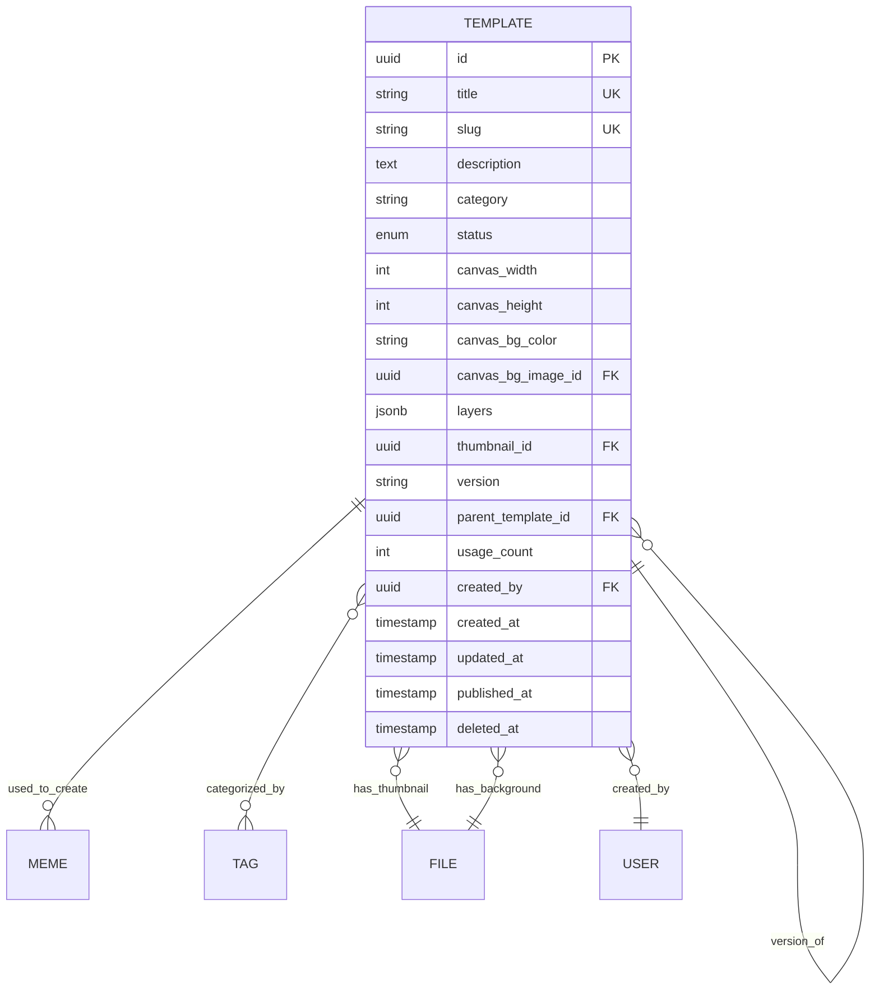

# Feature Specification: Meme Templates

## Feature Overview

### Purpose & Scope

The Meme Templates feature is the foundational system that defines the creative canvas and structure for meme creation.
Templates act as reusable blueprints containing layers, layouts, and styling configurations that users customize to
create unique memes.

**Business Objective**: Provide a flexible, scalable template system that enables rapid meme creation while maintaining
design consistency and creative freedom.

**Manufacturing Impact**: This is a product design and configuration system that defines the "production specifications"
for meme manufacturing. Templates are the master patterns from which all meme instances are derived.

### Functional Boundaries

#### In Scope

- Template creation and management (CRUD)
- Layer definition and configuration (Text/Image layers)
- Canvas properties (dimensions, background, styling)
- Template metadata (title, description, category, tags)
- Template versioning
- Template publishing workflow
- Asset management (backgrounds, default stickers)
- Template preview generation
- Template search and filtering
- Template categorization

#### Out of Scope

- Canvas rendering engine (frontend responsibility)
- Image manipulation/filters
- User-generated meme instances (separate Memes feature)
- Social interactions with templates
- Analytics on template usage (separate Analytics feature)
- E-commerce product integration

### Success Metrics

- Templates created per month
- Template usage rate (memes per template)
- Template creation time (target: < 10 minutes)
- Template load time (target: < 150ms)
- Template search accuracy
- Popular template identification
- Template versioning adoption rate

---

## Functional Requirements

### FR-1: Template Creation

**Priority**: Critical

**Description**: Admins must be able to create comprehensive template definitions with layers, styling, and metadata.

**Acceptance Criteria**:

```gherkin
Given an authenticated admin user
When the admin submits a template creation request
  With title, dimensions, layers, and metadata
Then a new template is created
  And a unique slug is generated
  And layers are validated and stored
  And the template is in DRAFT status
  And the template ID is returned
```

**Business Rules**:

- Only admins can create templates
- Titles can be duplicate (uniqueness enforced via slug, not title)
- Slug is auto-generated from title with guaranteed uniqueness
- If base slug exists, a random 7-character suffix is appended
- Must have at least one layer
- Canvas dimensions must be positive integers
- Default status is DRAFT until published

**Data Requirements**:

```typescript
interface CreateTemplateDto {
  title: string;                    // Required, 3-200 characters
  description?: string;             // Optional, max 2000 characters
  category?: string;                // Optional, e.g., "meme", "greeting", "poster"
  tags?: string[];                  // Optional, array of tag names

  // Canvas Configuration
  canvas: {
    width: number;                  // Required, 100-4000 pixels
    height: number;                 // Required, 100-4000 pixels
    backgroundColor?: string;       // Optional, hex color code
    backgroundImage?: {
      id: string;                   // File ID reference
    };
  };

  // Layer Definitions
  layers: Array<TextLayer | ImageLayer>;

  // Preview
  thumbnail?: {
    id: string;                     // File ID for preview image
  };

  // Publishing
  status?: 'DRAFT' | 'PUBLISHED';  // Optional, default DRAFT
}

interface TextLayer {
  type: 'TEXT';
  id: string;                       // Unique layer ID
  name: string;                     // Layer name
  order: number;                    // Z-index

  // Position & Transform
  x: number;                        // X coordinate
  y: number;                        // Y coordinate
  width: number;                    // Width
  height: number;                   // Height
  rotation?: number;                // Rotation in degrees

  // Text Properties
  defaultText?: string;             // Placeholder text
  fontSize: number;                 // Font size in pixels
  fontFamily: string;               // Font family name
  fontWeight?: string;              // normal, bold, etc.
  color: string;                    // Text color (hex)
  textAlign?: string;               // left, center, right

  // Styling
  strokeColor?: string;             // Stroke color (hex)
  strokeWidth?: number;             // Stroke width in pixels
  backgroundColor?: string;         // Background color (hex)
  backgroundOpacity?: number;       // 0-1
  shadow?: {
    color: string;
    blur: number;
    offsetX: number;
    offsetY: number;
  };

  // Constraints
  maxLength?: number;               // Character limit
  editable: boolean;                // Can user edit this layer
  required: boolean;                // Must user fill this layer
}

interface ImageLayer {
  type: 'IMAGE';
  id: string;                       // Unique layer ID
  name: string;                     // Layer name
  order: number;                    // Z-index

  // Position & Transform
  x: number;                        // X coordinate
  y: number;                        // Y coordinate
  width: number;                    // Width
  height: number;                   // Height
  rotation?: number;                // Rotation in degrees

  // Image Properties
  defaultImage?: {
    id: string;                     // File ID for default image
  };
  opacity?: number;                 // 0-1

  // Constraints
  editable: boolean;                // Can user replace this image
  required: boolean;                // Must user provide an image
  acceptedFormats?: string[];       // e.g., ['jpg', 'png', 'gif']
  maxFileSize?: number;             // Max size in bytes
}
```

### FR-2: Template Retrieval

**Priority**: Critical

**Description**: Users must be able to browse and search for templates efficiently.

**Acceptance Criteria**:

```gherkin
Given templates exist in the system
When a user requests template list
Then published templates are returned with pagination
  And templates include metadata and preview
  And templates can be filtered by category and tags
  And templates can be sorted by various criteria
```

**Retrieval Methods**:

1. **By ID**: Direct lookup for specific template
2. **By Slug**: SEO-friendly URL access
3. **By Category**: Filter templates by type
4. **By Tags**: Multi-tag filtering
5. **Search**: Full-text search on title and description
6. **Paginated List**: Browse with pagination

### FR-3: Template Update

**Priority**: High

**Description**: Admins must be able to update template definitions with version control.

**Acceptance Criteria**:

```gherkin
Given an admin user
And a template exists
When the admin submits an update request
Then template data is updated
  And if major changes, a new version is created
  And if title changes, slug is regenerated
  And existing memes are not affected
  And update timestamp is recorded
```

**Update Rules**:

- Only admins can update templates
- Breaking changes create new template version
- Non-breaking changes update current version
- If title changes, a new unique slug is regenerated
- Published templates can be updated but require review

**Version Control Strategy**:

- **Major Version**: Changes that affect existing memes (layer structure changes)
- **Minor Version**: Changes that don't affect existing memes (metadata, styling)
- **Patch Version**: Bug fixes and minor corrections

### FR-4: Template Publishing

**Priority**: High

**Description**: Templates must go through a publishing workflow before being available to users.

**Acceptance Criteria**:

```gherkin
Given a template in DRAFT status
When an admin publishes the template
Then template status changes to PUBLISHED
  And template becomes visible to all users
  And template appears in public listings
  And publish timestamp is recorded
```

**Publishing Rules**:

- Only admins can publish templates
- Template must have valid layers
- Template must have preview thumbnail
- Template must pass validation checks
- Published templates can be unpublished

**Status Flow**:

```text
DRAFT → PUBLISHED → ARCHIVED
  ↓         ↓
UNPUBLISHED ← ┘
```

### FR-5: Template Deletion

**Priority**: Medium

**Description**: Admins must be able to archive or delete templates safely.

**Acceptance Criteria**:

```gherkin
Given an admin user owns a template
When the admin requests template deletion
Then the template is soft-deleted
  And the deletion timestamp is recorded
  And the template is excluded from public listings
  And existing memes using this template are preserved
  And template data is retained for audit
```

**Deletion Rules**:

- Soft deletion (deletedAt timestamp)
- Only admins can delete
- Cannot delete if template has active memes (must archive)
- Associated assets are preserved
- Can be recovered by admin

### FR-6: Layer Validation

**Priority**: Critical

**Description**: Template layers must be validated for consistency and usability.

**Acceptance Criteria**:

```gherkin
Given a template with layers
When validating the template
Then all layer IDs are unique
  And all layer positions are within canvas bounds
  And all required fields are present
  And layer order values are sequential
  And no layer overlaps validation is performed
```

**Validation Rules**:

- Unique layer IDs within template
- Valid coordinates (within canvas)
- Valid colors (hex format)
- Valid font families (from allowed list)
- Layer order values are unique
- At least one editable layer

---

## Non-Functional Requirements

### Performance Requirements

| Operation          | Target Response Time | Maximum Load |
|--------------------|----------------------|--------------|
| Create Template    | < 500ms              | 20 req/hour  |
| Get Template by ID | < 150ms              | 1000 req/min |
| List Templates     | < 250ms              | 500 req/min  |
| Update Template    | < 400ms              | 10 req/hour  |
| Delete Template    | < 200ms              | 5 req/hour   |
| Search Templates   | < 300ms              | 200 req/min  |

### Security Requirements

- **Authentication**: All write operations require admin authentication
- **Authorization**: Only admins can create/update/delete templates
- **Input Validation**: All template data validated and sanitized
- **XSS Prevention**: Output encoding for user-facing content
- **Rate Limiting**: Prevent template spam creation

### Data Integrity

- **Foreign Key Constraints**: File references validated
- **Unique Constraints**: Slug globally unique (enforced at database and application level)
- **Soft Deletion**: Preserve template history
- **Transaction Support**: ACID compliance
- **Version Control**: Maintain template evolution history

### Scalability Requirements

- Support 10,000+ templates in database
- Handle 100+ concurrent template browsers
- Efficient layer serialization/deserialization
- CDN integration for template previews
- Database indexing on search fields

---

## Database Schema

### Template Entity

```sql
CREATE TABLE templates (
  id UUID PRIMARY KEY DEFAULT gen_random_uuid(),
  title VARCHAR(200) NOT NULL,
  slug VARCHAR(250) NOT NULL UNIQUE,
  description TEXT,
  category VARCHAR(100),
  status VARCHAR(20) NOT NULL DEFAULT 'DRAFT',

  -- Canvas Configuration
  canvas_width INTEGER NOT NULL,
  canvas_height INTEGER NOT NULL,
  canvas_background_color VARCHAR(7),
  canvas_background_image_id UUID REFERENCES files(id),

  -- Layers (JSONB for flexibility)
  layers JSONB NOT NULL,

  -- Preview
  thumbnail_id UUID REFERENCES files(id),

  -- Versioning
  version VARCHAR(20) DEFAULT '1.0.0',
  parent_template_id UUID REFERENCES templates(id),

  -- Metadata
  usage_count INTEGER DEFAULT 0,
  created_by UUID REFERENCES users(id),

  -- Timestamps
  created_at TIMESTAMP DEFAULT CURRENT_TIMESTAMP,
  updated_at TIMESTAMP DEFAULT CURRENT_TIMESTAMP,
  published_at TIMESTAMP NULL,
  deleted_at TIMESTAMP NULL,

  -- Indexes
  INDEX idx_templates_status (status),
  INDEX idx_templates_category (category),
  INDEX idx_templates_created_at (created_at DESC),
  INDEX idx_templates_slug (slug),
  INDEX idx_templates_deleted_at (deleted_at),
  INDEX idx_templates_usage_count (usage_count DESC),
  INDEX idx_templates_title (title),  -- For title searches

  -- Full-text search
  INDEX idx_templates_search USING gin(to_tsvector('english', title || ' ' || COALESCE(description, ''))),

  -- Constraints
  CONSTRAINT chk_status CHECK (status IN ('DRAFT', 'PUBLISHED', 'ARCHIVED', 'UNPUBLISHED')),
  CONSTRAINT chk_canvas_dimensions CHECK (canvas_width > 0 AND canvas_height > 0)
  -- Note: No unique constraint on title - uniqueness enforced via slug only
);

-- Template Tags (Many-to-Many)
CREATE TABLE template_tags (
  template_id UUID REFERENCES templates(id) ON DELETE CASCADE,
  tag_id UUID REFERENCES tags(id) ON DELETE CASCADE,
  PRIMARY KEY (template_id, tag_id)
);
```

### Layer Schema (JSONB Structure)

```json
{
  "layers": [
    {
      "id": "layer-1",
      "type": "TEXT",
      "name": "Top Text",
      "order": 1,
      "x": 50,
      "y": 20,
      "width": 400,
      "height": 80,
      "rotation": 0,
      "defaultText": "Enter top text",
      "fontSize": 48,
      "fontFamily": "Impact",
      "fontWeight": "bold",
      "color": "#FFFFFF",
      "textAlign": "center",
      "strokeColor": "#000000",
      "strokeWidth": 2,
      "editable": true,
      "required": false,
      "maxLength": 100
    },
    {
      "id": "layer-2",
      "type": "IMAGE",
      "name": "Background Image",
      "order": 0,
      "x": 0,
      "y": 0,
      "width": 500,
      "height": 500,
      "rotation": 0,
      "defaultImage": {
        "id": "file-uuid"
      },
      "opacity": 1,
      "editable": false,
      "required": true
    }
  ]
}
```

### Relationships



---

## API Endpoints

### Create Template

```http
POST /v1/templates
Authorization: Bearer <admin-token>
Content-Type: application/json

Request Body:
{
  "title": "Drake Hotline Bling Meme",
  "description": "Classic Drake meme format with two contrasting reactions",
  "category": "meme",
  "tags": ["drake", "reaction", "comparison"],
  "canvas": {
    "width": 500,
    "height": 600,
    "backgroundColor": "#FFFFFF"
  },
  "layers": [
    {
      "type": "IMAGE",
      "id": "bg-layer",
      "name": "Background",
      "order": 0,
      "x": 0,
      "y": 0,
      "width": 500,
      "height": 600,
      "defaultImage": {
        "id": "file-uuid-1"
      },
      "editable": false,
      "required": true
    },
    {
      "type": "TEXT",
      "id": "text-top",
      "name": "Top Text",
      "order": 1,
      "x": 250,
      "y": 150,
      "width": 200,
      "height": 100,
      "fontSize": 32,
      "fontFamily": "Arial",
      "fontWeight": "bold",
      "color": "#000000",
      "textAlign": "center",
      "editable": true,
      "required": true,
      "maxLength": 50
    },
    {
      "type": "TEXT",
      "id": "text-bottom",
      "name": "Bottom Text",
      "order": 2,
      "x": 250,
      "y": 450,
      "width": 200,
      "height": 100,
      "fontSize": 32,
      "fontFamily": "Arial",
      "fontWeight": "bold",
      "color": "#000000",
      "textAlign": "center",
      "editable": true,
      "required": true,
      "maxLength": 50
    }
  ],
  "status": "DRAFT"
}

Response 201 Created:
{
  "success": true,
  "message": "Template created successfully",
  "data": {
    "id": "template-uuid",
    "title": "Drake Hotline Bling Meme",
    "slug": "drake-hotline-bling-meme",
    "description": "Classic Drake meme format with two contrasting reactions",
    "category": "meme",
    "status": "DRAFT",
    "canvas": {
      "width": 500,
      "height": 600,
      "backgroundColor": "#FFFFFF"
    },
    "layers": [...],
    "tags": ["drake", "reaction", "comparison"],
    "version": "1.0.0",
    "createdAt": "2025-11-07T10:00:00Z",
    "updatedAt": "2025-11-07T10:00:00Z"
  }
}
```

### Get Template List

```http
GET /v1/templates?page=1&limit=20&category=meme&status=PUBLISHED&search=drake
Authorization: Optional

Response 200 OK:
{
  "success": true,
  "message": "Templates fetched successfully",
  "data": [
    {
      "id": "template-uuid",
      "title": "Drake Hotline Bling Meme",
      "slug": "drake-hotline-bling-meme",
      "description": "Classic Drake meme format",
      "category": "meme",
      "status": "PUBLISHED",
      "thumbnail": {
        "id": "file-uuid",
        "path": "/uploads/thumbnails/drake-template.jpg"
      },
      "canvas": {
        "width": 500,
        "height": 600
      },
      "usageCount": 1523,
      "tags": ["drake", "reaction"],
      "createdAt": "2025-11-07T10:00:00Z"
    }
  ],
  "meta": {
    "page": 1,
    "limit": 20,
    "total": 45,
    "totalPages": 3
  }
}
```

### Get Template by ID

```http
GET /v1/templates/:templateId
Authorization: Optional

Response 200 OK:
{
  "success": true,
  "message": "Template fetched successfully",
  "data": {
    "id": "template-uuid",
    "title": "Drake Hotline Bling Meme",
    "slug": "drake-hotline-bling-meme",
    "description": "Classic Drake meme format with two contrasting reactions",
    "category": "meme",
    "status": "PUBLISHED",
    "canvas": {
      "width": 500,
      "height": 600,
      "backgroundColor": "#FFFFFF",
      "backgroundImage": null
    },
    "layers": [
      {
        "type": "IMAGE",
        "id": "bg-layer",
        "name": "Background",
        "order": 0,
        "x": 0,
        "y": 0,
        "width": 500,
        "height": 600,
        "defaultImage": {
          "id": "file-uuid-1",
          "path": "/uploads/drake-bg.jpg"
        },
        "editable": false,
        "required": true
      },
      {
        "type": "TEXT",
        "id": "text-top",
        "name": "Top Text",
        "order": 1,
        "x": 250,
        "y": 150,
        "width": 200,
        "height": 100,
        "fontSize": 32,
        "fontFamily": "Arial",
        "fontWeight": "bold",
        "color": "#000000",
        "textAlign": "center",
        "editable": true,
        "required": true,
        "maxLength": 50
      }
    ],
    "thumbnail": {
      "id": "thumb-uuid",
      "path": "/uploads/thumbnails/drake-template.jpg"
    },
    "tags": ["drake", "reaction", "comparison"],
    "version": "1.0.0",
    "usageCount": 1523,
    "createdBy": {
      "id": "admin-uuid",
      "email": "admin@ilomememes.com"
    },
    "createdAt": "2025-11-07T10:00:00Z",
    "updatedAt": "2025-11-07T10:00:00Z",
    "publishedAt": "2025-11-07T11:00:00Z"
  }
}
```

### Update Template

```http
PATCH /v1/templates/:templateId
Authorization: Bearer <admin-token>
Content-Type: application/json

Request Body:
{
  "title": "Drake Meme - Updated",
  "description": "Updated description",
  "status": "PUBLISHED"
}

Response 200 OK:
{
  "success": true,
  "message": "Template updated successfully",
  "data": {
    "id": "template-uuid",
    "title": "Drake Meme - Updated",
    "slug": "drake-meme-updated",
    "version": "1.0.1",
    "updatedAt": "2025-11-07T12:00:00Z"
  }
}
```

### Publish Template

```http
POST /v1/templates/:templateId/publish
Authorization: Bearer <admin-token>

Response 200 OK:
{
  "success": true,
  "message": "Template published successfully",
  "data": {
    "id": "template-uuid",
    "status": "PUBLISHED",
    "publishedAt": "2025-11-07T12:00:00Z"
  }
}
```

### Delete Template

```http
DELETE /v1/templates/:templateId
Authorization: Bearer <admin-token>

Response 200 OK:
{
  "success": true,
  "message": "Template deleted successfully"
}
```

---

## Business Logic & Rules

### Slug Generation

Template slugs are guaranteed to be unique using the same algorithm as memes:

```typescript
function generateBaseSlug(title: string): string {
  return title
    .toString()
    .trim()
    .toLowerCase()
    .replace(/[^a-z0-9]+/g, '-')  // Replace non-alphanumeric with hyphens
    .replace(/(^-|-$)+/g, '');     // Remove leading/trailing hyphens
}

function generateRandomString(length: number = 7): string {
  const chars = 'abcdefghijklmnopqrstuvwxyz0123456789';
  let result = '';
  for (let i = 0; i < length; i++) {
    result += chars.charAt(Math.floor(Math.random() * chars.length));
  }
  return result;
}

async function generateUniqueTemplateSlug(title: string): Promise<string> {
  const baseSlug = generateBaseSlug(title);

  // Check if base slug is available
  const existingTemplate = await templatesRepository.findBySlug(baseSlug);

  if (!existingTemplate) {
    return baseSlug;
  }

  // Slug conflict detected, append random 7-character string
  let uniqueSlug: string;
  let attempts = 0;
  const maxAttempts = 10;

  do {
    const randomSuffix = generateRandomString(7);
    uniqueSlug = `${baseSlug}-${randomSuffix}`;

    const conflictingTemplate = await templatesRepository.findBySlug(uniqueSlug);

    if (!conflictingTemplate) {
      return uniqueSlug;
    }

    attempts++;
  } while (attempts < maxAttempts);

  // Fallback: use timestamp-based suffix if random generation fails
  const timestamp = Date.now().toString(36);
  return `${baseSlug}-${timestamp}`;
}
```

**Rules**:

- Convert to lowercase
- Replace spaces and special characters with hyphens
- Remove leading/trailing hyphens
- **Always unique across all templates** (enforced by database constraint and generation logic)
- If base slug exists, append 7-character random string
- Random string uses lowercase letters and numbers only
- Multiple templates with same title get different random suffixes
- Maximum 250 characters (base slug + hyphen + 7 chars)
- Fallback to timestamp if random generation fails after 10 attempts

**Examples**:

```typescript
// First template with title "Drake Meme"
await generateUniqueTemplateSlug("Drake Meme");
// Returns: "drake-meme"

// Second template with title "Drake Meme"
await generateUniqueTemplateSlug("Drake Meme");
// Returns: "drake-meme-k8m3n2x"

// Third template with title "Drake Meme"
await generateUniqueTemplateSlug("Drake Meme");
// Returns: "drake-meme-p5w9t7q"

// Template with title "Super!!! Cool??? Template"
await generateUniqueTemplateSlug("Super!!! Cool??? Template");
// Returns: "super-cool-template"
```

### Layer Validation

```typescript
function validateLayers(layers: Layer[]): ValidationResult {
  const errors: string[] = [];
  const layerIds = new Set<string>();

  // Check for at least one layer
  if (layers.length === 0) {
    errors.push('Template must have at least one layer');
  }

  // Validate each layer
  layers.forEach((layer, index) => {
    // Unique ID check
    if (layerIds.has(layer.id)) {
      errors.push(`Duplicate layer ID: ${layer.id}`);
    }
    layerIds.add(layer.id);

    // Required fields
    if (!layer.name) {
      errors.push(`Layer ${index} missing name`);
    }

    // Position validation
    if (layer.x < 0 || layer.y < 0) {
      errors.push(`Layer ${layer.id} has invalid position`);
    }

    // Type-specific validation
    if (layer.type === 'TEXT') {
      validateTextLayer(layer as TextLayer, errors);
    } else if (layer.type === 'IMAGE') {
      validateImageLayer(layer as ImageLayer, errors);
    }
  });

  return {
    valid: errors.length === 0,
    errors
  };
}

function validateTextLayer(layer: TextLayer, errors: string[]): void {
  if (layer.fontSize <= 0) {
    errors.push(`Layer ${layer.id}: Invalid font size`);
  }

  if (!layer.fontFamily) {
    errors.push(`Layer ${layer.id}: Font family is required`);
  }

  if (!/^#[0-9A-F]{6}$/i.test(layer.color)) {
    errors.push(`Layer ${layer.id}: Invalid color format`);
  }
}

function validateImageLayer(layer: ImageLayer, errors: string[]): void {
  if (layer.opacity !== undefined && (layer.opacity < 0 || layer.opacity > 1)) {
    errors.push(`Layer ${layer.id}: Opacity must be between 0 and 1`);
  }

  if (layer.required && !layer.defaultImage) {
    errors.push(`Layer ${layer.id}: Required layers must have default image`);
  }
}
```

### Template Versioning

```typescript
interface TemplateVersion {
  major: number;
  minor: number;
  patch: number;
}

function parseVersion(version: string): TemplateVersion {
  const [major, minor, patch] = version.split('.').map(Number);
  return { major, minor, patch };
}

function incrementVersion(
  currentVersion: string,
  changeType: 'major' | 'minor' | 'patch'
): string {
  const version = parseVersion(currentVersion);

  switch (changeType) {
    case 'major':
      return `${version.major + 1}.0.0`;
    case 'minor':
      return `${version.major}.${version.minor + 1}.0`;
    case 'patch':
      return `${version.major}.${version.minor}.${version.patch + 1}`;
  }
}

// Determine change type based on modifications
function determineChangeType(
  oldTemplate: Template,
  newTemplate: Template
): 'major' | 'minor' | 'patch' {
  // Major: Layer structure changes
  if (hasLayerStructureChanges(oldTemplate, newTemplate)) {
    return 'major';
  }

  // Minor: Metadata or non-breaking changes
  if (hasMetadataChanges(oldTemplate, newTemplate)) {
    return 'minor';
  }

  // Patch: Bug fixes, typos
  return 'patch';
}
```

### Publishing Workflow

```typescript
async function publishTemplate(templateId: string): Promise<Template> {
  const template = await templatesRepository.findById(templateId);

  if (!template) {
    throw new NotFoundException('Template not found');
  }

  if (template.status === 'PUBLISHED') {
    throw new ConflictException('Template is already published');
  }

  // Validation checks
  const validation = validateLayers(template.layers);
  if (!validation.valid) {
    throw new ValidationException('Template validation failed', validation.errors);
  }

  if (!template.thumbnail) {
    throw new ValidationException('Template must have a thumbnail');
  }

  // Update status
  template.status = 'PUBLISHED';
  template.publishedAt = new Date();

  return await templatesRepository.update(templateId, template);
}
```

---

## Integration Points

### Dependencies

- **Files Module**: Background images, thumbnails, layer images
- **Users Module**: Creator authentication and authorization
- **Tags Module**: Template categorization
- **Memes Module**: Template usage tracking

### External Integrations

- **File Storage (S3/Local)**: Asset storage
- **CDN**: Template preview delivery
- **Search Service**: Full-text template search
- **Analytics Service**: Usage tracking

---

## Testing Strategy

### Unit Tests

- Template creation validation
- Slug generation
- Layer validation logic
- Version increment logic
- Authorization checks

### Integration Tests

- Create template with layers
- Update template versions
- Publish workflow
- Template search and filtering
- Soft deletion

### E2E Tests

- Complete template creation flow
- Template browsing and selection
- Template-to-meme workflow
- Admin template management

---

## Future Enhancements

### Phase 2

- Template categories with hierarchy
- Template collections/bundles
- Template recommendations
- AI-generated templates
- Template marketplace

### Phase 3

- Collaborative template editing
- Template remixing
- Dynamic layer configurations
- Advanced layer effects
- Template analytics dashboard

---

## Changelog

| Version | Date       | Changes                       |
|---------|------------|-------------------------------|
| 1.0.0   | 2025-11-07 | Initial feature specification |
