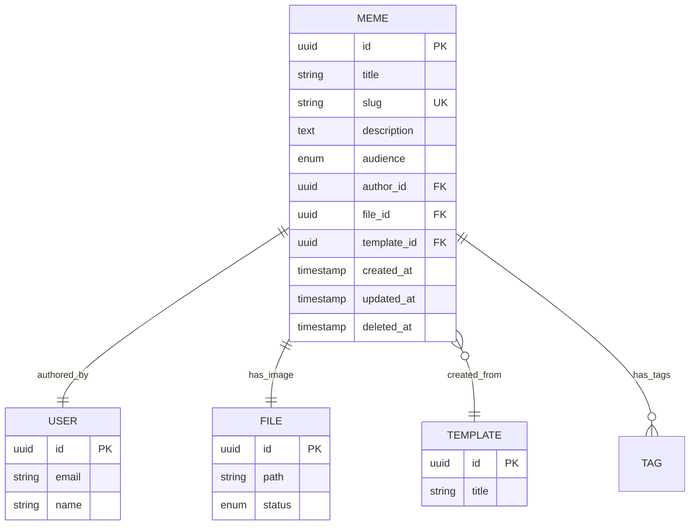

# Feature Specification: Memes

## Feature Overview

### Purpose & Scope

The Memes feature is the core content creation and management system of the ILoveMemes platform. It enables users to create, store, manage, and share meme instances generated from templates. This feature serves as the bridge between template-based creation and community engagement.

**Business Objective**: Enable users to express creativity through meme creation while building a robust content library that drives community engagement and e-commerce conversions.

**Manufacturing Impact**: This is a content production system that processes user-generated content at scale, requiring efficient storage, retrieval, and rendering capabilities.

### Functional Boundaries

#### In Scope

- Meme instance creation from templates
- Personal meme library management (CRUD operations)
- Public/private audience control
- File association and management
- Slug-based URL generation
- Meme metadata management (title, description)
- Author attribution and ownership
- Soft deletion for data retention
- Search and filtering capabilities
- Pagination for large datasets

#### Out of Scope

- Canvas rendering logic (handled by frontend)
- Image manipulation and filters (handled by separate service)
- Social interactions (upvotes, comments) - separate feature
- Product integration - separate feature
- Analytics and metrics - separate feature

### Success Metrics

- Memes created per day/week/month
- Average creation time per meme
- Public vs private meme ratio
- Storage utilization efficiency
- API response time < 200ms for list operations
- API response time < 100ms for single meme retrieval

---

## Functional Requirements

### FR-1: Meme Creation

**Priority**: Critical

**Description**: Users must be able to create meme instances from existing templates with custom content.

**Acceptance Criteria**:

```gherkin
Given an authenticated user
And a valid template exists
When the user submits meme creation request
  With title, description, file reference, and audience setting
Then a new meme instance is created
  And the meme is associated with the user as author
  And a unique slug is generated from the title
  And the file status is updated to PERMANENT
  And the meme ID is returned
```

**Business Rules**:

- Titles can be duplicate (uniqueness enforced via slug, not title)
- Slug is auto-generated from title with guaranteed uniqueness
- If base slug exists, a random 7-character suffix is appended
- File must exist and be in TEMPORARY status
- Authenticated users only
- Audience can be PUBLIC or PRIVATE

**Data Requirements**:

```typescript
interface CreateMemeDto {
  title: string;              // Required, 3-200 characters
  description?: string;       // Optional, max 1000 characters
  file: {
    id: string;              // Required, valid file ID
  };
  audience: 'PUBLIC' | 'PRIVATE'; // Required
  template?: {
    id: string;              // Optional, template reference
  };
}
```

### FR-2: Meme Retrieval

**Priority**: Critical

**Description**: Users and systems must be able to retrieve meme information efficiently.

**Acceptance Criteria**:

```gherkin
Given memes exist in the system
When a user requests meme list
Then memes are returned with pagination
  And public memes are visible to all users
  And private memes are visible only to authors
  And deleted memes are excluded from results
```

**Retrieval Methods**:

1. **By ID**: Direct lookup for specific meme
2. **By Slug**: SEO-friendly URL access
3. **By Title**: Uniqueness validation
4. **By Author**: User's personal library
5. **By File**: Reverse lookup from file reference
6. **Paginated List**: Browse with filtering

### FR-3: Meme Update

**Priority**: High

**Description**: Meme authors must be able to update their meme metadata and content.

**Acceptance Criteria**:

```gherkin
Given an authenticated user owns a meme
When the user submits an update request
Then the meme metadata is updated
  And if title changes, slug is regenerated
  And if file changes, old file is marked TEMPORARY
  And if file changes, new file is marked PERMANENT
  And update timestamp is recorded
```

**Update Restrictions**:

- Only the author can update their meme
- Title uniqueness is validated (excluding current meme)
- Template reference cannot be changed
- Author cannot be changed
- Creation timestamp cannot be changed

### FR-4: Meme Deletion

**Priority**: High

**Description**: Users must be able to delete their memes with data retention for audit purposes.

**Acceptance Criteria**:

```gherkin
Given an authenticated user owns a meme
When the user requests meme deletion
Then the meme is soft-deleted
  And the deletion timestamp is recorded
  And the meme is excluded from public listings
  And the meme data is retained for audit
  And associated file is marked TEMPORARY
```

**Deletion Rules**:

- Soft deletion (deletedAt timestamp)
- Only author can delete
- Admin can delete any meme
- Associated data (file) is preserved
- Can be recovered by admin if needed

### FR-5: Audience Control

**Priority**: High

**Description**: Users must control the visibility of their memes.

**Acceptance Criteria**:

```gherkin
Given a user creates or updates a meme
When setting audience to PRIVATE
Then the meme is visible only to the author
When setting audience to PUBLIC
Then the meme is visible to all users
```

**Audience Options**:

- **PUBLIC**: Visible in community gallery, searchable, shareable
- **PRIVATE**: Personal collection only, not listed publicly

---

## Non-Functional Requirements

### Performance Requirements

| Operation              | Target Response Time | Maximum Load         |
| ---------------------- | -------------------- | -------------------- |
| Create Meme            | < 300ms              | 100 req/min per user |
| Get Meme by ID         | < 100ms              | 1000 req/min         |
| List Memes (Paginated) | < 200ms              | 500 req/min          |
| Update Meme            | < 200ms              | 50 req/min per user  |
| Delete Meme            | < 150ms              | 20 req/min per user  |
| Search Memes           | < 300ms              | 200 req/min          |

### Security Requirements

- **Authentication**: All write operations require JWT authentication
- **Authorization**: Users can only modify their own memes
- **Input Validation**: All inputs sanitized and validated
- **SQL Injection**: Protected via ORM parameterization
- **XSS Prevention**: Output encoding for user-generated content
- **Rate Limiting**: Per-user rate limits on creation/deletion

### Data Integrity

- **Foreign Key Constraints**: Author, File, Template references
- **Unique Constraints**: Slug globally unique (enforced at database and application level)
- **Soft Deletion**: Preserve data for audit trail
- **Transaction Support**: ACID compliance for updates
- **Backup Strategy**: Daily automated backups

### Scalability Requirements

- Support 100,000+ memes in database
- Handle 1000+ concurrent users
- Horizontal scaling via read replicas
- CDN integration for file delivery
- Database indexing on frequently queried fields

---

## Database Schema

### Meme Entity

```sql
CREATE TABLE memes (
  id UUID PRIMARY KEY DEFAULT gen_random_uuid(),
  title VARCHAR(200) NOT NULL,
  slug VARCHAR(250) NOT NULL UNIQUE,
  description TEXT,
  audience VARCHAR(20) NOT NULL DEFAULT 'PUBLIC',

  -- Relationships
  author_id UUID NOT NULL REFERENCES users(id),
  file_id UUID NOT NULL REFERENCES files(id),
  template_id UUID REFERENCES templates(id),

  -- Timestamps
  created_at TIMESTAMP DEFAULT CURRENT_TIMESTAMP,
  updated_at TIMESTAMP DEFAULT CURRENT_TIMESTAMP,
  deleted_at TIMESTAMP NULL,

  -- Indexes
  INDEX idx_memes_author (author_id),
  INDEX idx_memes_template (template_id),
  INDEX idx_memes_audience (audience),
  INDEX idx_memes_created_at (created_at DESC),
  INDEX idx_memes_slug (slug),
  INDEX idx_memes_deleted_at (deleted_at),
  INDEX idx_memes_title (title),  -- For title searches

  -- Constraints
  CONSTRAINT chk_audience CHECK (audience IN ('PUBLIC', 'PRIVATE'))
  -- Note: No unique constraint on title - uniqueness enforced via slug only
);
```

### Relationships



---

## API Endpoints

### Create Meme

```http
POST /v1/memes
Authorization: Bearer <token>
Content-Type: application/json

Request Body:
{
  "title": "My Funny Meme",
  "description": "A hilarious take on daily life",
  "file": {
    "id": "123e4567-e89b-12d3-a456-426614174000"
  },
  "audience": "PUBLIC",
  "template": {
    "id": "123e4567-e89b-12d3-a456-426614174001"
  }
}

Response 201 Created:
{
  "success": true,
  "message": "Meme created successfully",
  "data": {
    "id": "123e4567-e89b-12d3-a456-426614174002",
    "title": "My Funny Meme",
    "slug": "my-funny-meme",
    "description": "A hilarious take on daily life",
    "audience": "PUBLIC",
    "author": {
      "id": "123e4567-e89b-12d3-a456-426614174003",
      "email": "user@example.com"
    },
    "file": {
      "id": "123e4567-e89b-12d3-a456-426614174000",
      "path": "/uploads/meme-image.jpg"
    },
    "template": {
      "id": "123e4567-e89b-12d3-a456-426614174001",
      "title": "Drake Meme"
    },
    "createdAt": "2025-11-07T10:30:00Z",
    "updatedAt": "2025-11-07T10:30:00Z"
  }
}
```

### Get Meme List

```http
GET /v1/memes?page=1&limit=20&search=funny&audience=PUBLIC
Authorization: Optional

Response 200 OK:
{
  "success": true,
  "message": "Memes fetched successfully",
  "data": [
    {
      "id": "123e4567-e89b-12d3-a456-426614174002",
      "title": "My Funny Meme",
      "slug": "my-funny-meme",
      "description": "A hilarious take on daily life",
      "audience": "PUBLIC",
      "author": {
        "id": "123e4567-e89b-12d3-a456-426614174003",
        "email": "user@example.com"
      },
      "file": {
        "id": "123e4567-e89b-12d3-a456-426614174000",
        "path": "/uploads/meme-image.jpg"
      },
      "createdAt": "2025-11-07T10:30:00Z"
    }
  ],
  "meta": {
    "page": 1,
    "limit": 20,
    "total": 150,
    "totalPages": 8
  }
}
```

### Get Meme by ID

```http
GET /v1/memes/:memeId
Authorization: Optional

Response 200 OK:
{
  "success": true,
  "message": "Meme fetched successfully",
  "data": {
    "id": "123e4567-e89b-12d3-a456-426614174002",
    "title": "My Funny Meme",
    "slug": "my-funny-meme",
    "description": "A hilarious take on daily life",
    "audience": "PUBLIC",
    "author": {
      "id": "123e4567-e89b-12d3-a456-426614174003",
      "email": "user@example.com"
    },
    "file": {
      "id": "123e4567-e89b-12d3-a456-426614174000",
      "path": "/uploads/meme-image.jpg"
    },
    "template": {
      "id": "123e4567-e89b-12d3-a456-426614174001",
      "title": "Drake Meme"
    },
    "createdAt": "2025-11-07T10:30:00Z",
    "updatedAt": "2025-11-07T10:30:00Z"
  }
}
```

### Get My Memes

```http
GET /v1/memes/me
Authorization: Bearer <token>

Response 200 OK:
{
  "success": true,
  "message": "User memes fetched successfully",
  "data": [
    {
      "id": "123e4567-e89b-12d3-a456-426614174002",
      "title": "My Funny Meme",
      "slug": "my-funny-meme",
      "audience": "PUBLIC",
      "file": {
        "path": "/uploads/meme-image.jpg"
      },
      "createdAt": "2025-11-07T10:30:00Z"
    }
  ]
}
```

### Update Meme

```http
PATCH /v1/memes/:memeId
Authorization: Bearer <token>
Content-Type: application/json

Request Body:
{
  "title": "Updated Meme Title",
  "description": "Updated description",
  "audience": "PRIVATE"
}

Response 200 OK:
{
  "success": true,
  "message": "Meme updated successfully",
  "data": {
    "id": "123e4567-e89b-12d3-a456-426614174002",
    "title": "Updated Meme Title",
    "slug": "updated-meme-title",
    "description": "Updated description",
    "audience": "PRIVATE",
    "updatedAt": "2025-11-07T11:00:00Z"
  }
}
```

### Delete Meme

```http
DELETE /v1/memes/:memeId
Authorization: Bearer <token>

Response 200 OK:
{
  "success": true,
  "message": "Meme deleted successfully"
}
```

---

## Business Logic & Rules

### Slug Generation Algorithm

```typescript
function generateBaseSlug(title: string): string {
  return title
    .toString()
    .trim()
    .toLowerCase()
    .replace(/[^a-z0-9]+/g, '-')  // Replace non-alphanumeric with hyphens
    .replace(/(^-|-$)+/g, '');     // Remove leading/trailing hyphens
}

function generateRandomString(length: number = 7): string {
  const chars = 'abcdefghijklmnopqrstuvwxyz0123456789';
  let result = '';
  for (let i = 0; i < length; i++) {
    result += chars.charAt(Math.floor(Math.random() * chars.length));
  }
  return result;
}

async function generateUniqueSlug(title: string): Promise<string> {
  const baseSlug = generateBaseSlug(title);

  // Check if base slug is available
  const existingMeme = await memesRepository.findBySlug(baseSlug);

  if (!existingMeme) {
    return baseSlug;
  }

  // Slug conflict detected, append random 7-character string
  let uniqueSlug: string;
  let attempts = 0;
  const maxAttempts = 10;

  do {
    const randomSuffix = generateRandomString(7);
    uniqueSlug = `${baseSlug}-${randomSuffix}`;

    const conflictingMeme = await memesRepository.findBySlug(uniqueSlug);

    if (!conflictingMeme) {
      return uniqueSlug;
    }

    attempts++;
  } while (attempts < maxAttempts);

  // Fallback: use timestamp-based suffix if random generation fails
  const timestamp = Date.now().toString(36);
  return `${baseSlug}-${timestamp}`;
}
```

**Rules**:

- Convert to lowercase
- Replace spaces and special characters with hyphens
- Remove leading/trailing hyphens
- **Always unique across all memes** (enforced by database constraint and generation logic)
- If base slug exists, append 7-character random string
- Random string uses lowercase letters and numbers only
- Multiple memes with same title get different random suffixes
- Maximum 250 characters (base slug + hyphen + 7 chars)
- Fallback to timestamp if random generation fails after 10 attempts

**Examples**:

```typescript
// First meme with title "I Love Memes"
await generateUniqueSlug("I Love Memes");
// Returns: "i-love-memes"

// Second meme with title "I Love Memes"
await generateUniqueSlug("I Love Memes");
// Returns: "i-love-memes-a3b7k2m"

// Third meme with title "I Love Memes"
await generateUniqueSlug("I Love Memes");
// Returns: "i-love-memes-x9w4t1p"

// Meme with title "Hello!!! World???"
await generateUniqueSlug("Hello!!! World???");
// Returns: "hello-world"
```

### File Status Management

When a meme is created or updated:

1. **New File Association**:
   - Verify file exists
   - Check file status is TEMPORARY
   - Update file status to PERMANENT
   - Create meme-file relationship

2. **File Replacement**:
   - Mark old file as TEMPORARY
   - Verify new file exists
   - Update new file to PERMANENT
   - Update meme-file relationship

3. **Meme Deletion**:
   - Soft delete meme (set deletedAt)
   - Mark associated file as TEMPORARY
   - File cleanup handled by background job

### Title Uniqueness Validation

**Note**: With unique slug generation, titles no longer need to be unique. Multiple memes can have the same title, but each will have a unique slug.

```typescript
// Title validation is now optional - slugs handle uniqueness
// This validation can be kept for UX purposes to warn users about similar titles

// On Create (Optional warning, not an error)
async checkTitleSimilarity(title: string, userId: string): Promise<boolean> {
  const existingMeme = await memesRepository.findOne({
    where: { title, authorId: userId, deletedAt: IsNull() }
  });

  // Return true if similar title exists (can show warning in UI)
  return !!existingMeme;
}

// Slug uniqueness is guaranteed by the generateUniqueSlug function
// No validation needed as it's handled during generation
```

### Authorization Rules

```typescript
// Ownership check
function canModifyMeme(user: User, meme: Meme): boolean {
  return user.id === meme.author.id || user.role === Role.ADMIN;
}

// Visibility check
function canViewMeme(user: User | null, meme: Meme): boolean {
  if (meme.audience === 'PUBLIC') return true;
  if (!user) return false;
  return user.id === meme.author.id || user.role === Role.ADMIN;
}
```

---

## Error Handling

### Error Scenarios

| Scenario                             | HTTP Status | Error Code       | Message                                 |
| ------------------------------------ | ----------- | ---------------- | --------------------------------------- |
| Unauthenticated create/update/delete | 401         | UNAUTHORIZED     | User not authenticated                  |
| Unauthorized update/delete           | 403         | FORBIDDEN        | You are not allowed to modify this meme |
| Meme not found                       | 404         | NOT_FOUND        | Meme not found                          |
| Invalid file ID                      | 422         | INVALID_FILE     | Incorrect File ID                       |
| File already used                    | 422         | FILE_IN_USE      | File already linked with another meme   |
| Slug generation failure              | 500         | SLUG_ERROR       | Failed to generate unique slug          |
| Validation errors                    | 400         | VALIDATION_ERROR | Validation failed: [details]            |

**Note**: Duplicate title is no longer an error since slugs ensure uniqueness.

### Error Response Format

```json
{
  "success": false,
  "message": "Error message",
  "errors": {
    "field": "Specific error details"
  },
  "statusCode": 422
}
```

---

## Integration Points

### Dependencies

- **Files Module**: File storage and management
- **Users Module**: Author authentication and authorization
- **Templates Module**: Template reference and validation
- **Tags Module**: Tag associations (future)

### External Integrations

- **File Storage (S3/Local)**: Image storage
- **CDN**: Image delivery
- **Search Service**: Full-text search (future)
- **Analytics Service**: Usage tracking (future)

---

## Testing Strategy

### Unit Tests

- Meme creation with valid data
- Slug generation from various titles
- Title uniqueness validation
- File status updates
- Authorization checks
- Soft deletion logic

### Integration Tests

- Create meme with file association
- Update meme with file replacement
- Delete meme cascade effects
- Pagination and filtering
- Search functionality

### E2E Tests

- Complete meme creation flow
- User personal library management
- Public meme browsing
- Authorization enforcement

### Performance Tests

- Load test: 1000 concurrent meme creations
- Stress test: Pagination with 100,000+ memes
- Response time monitoring

---

## Monitoring & Logging

### Key Metrics

- Memes created per hour/day
- Average meme creation time
- Failed creation attempts
- Storage utilization
- API response times
- Error rates

### Logging Requirements

- All meme operations (create, update, delete)
- Authorization failures
- File association changes
- Database errors
- Performance anomalies

### Alerts

- Creation failure rate > 5%
- Response time > 500ms
- Storage utilization > 80%
- Database connection errors

---

## Future Enhancements

### Phase 2 Features

- Meme versioning and edit history
- Duplicate detection
- Bulk operations
- Advanced search with filters
- Meme collections/albums
- Collaborative editing

### Phase 3 Features

- AI-powered meme suggestions
- Auto-tagging based on content
- Meme remixing capabilities
- Export to multiple formats
- Scheduled publishing

---

## Changelog

| Version | Date       | Changes                       |
| ------- | ---------- | ----------------------------- |
| 1.0.0   | 2025-11-07 | Initial feature specification |
