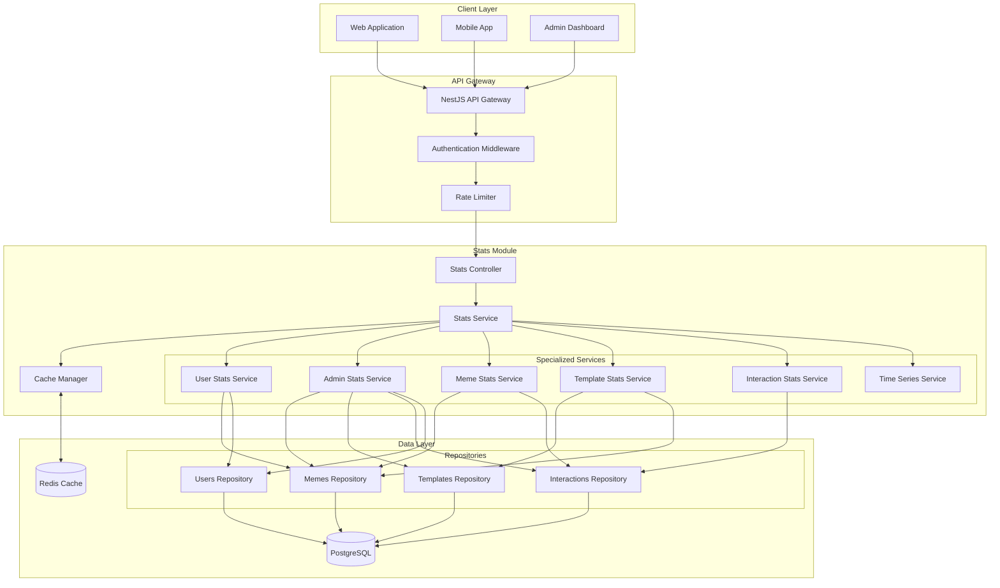
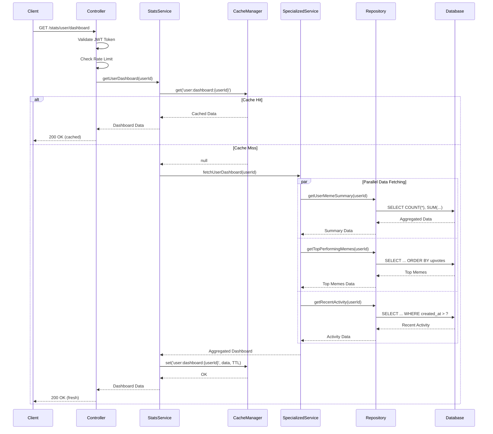
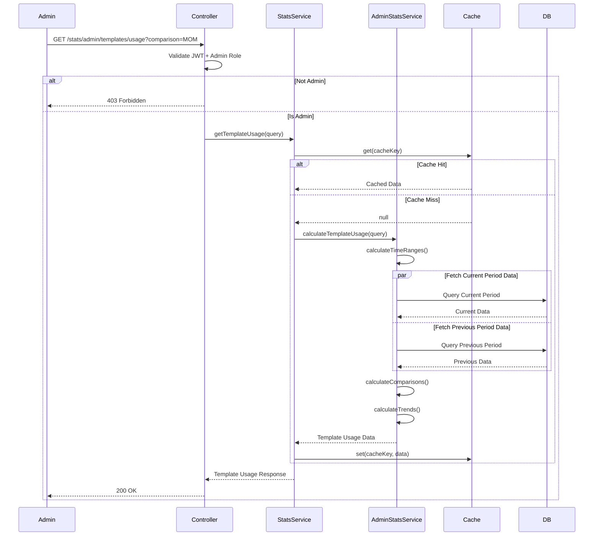
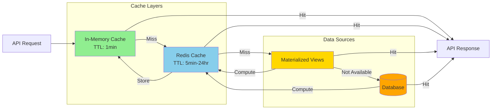
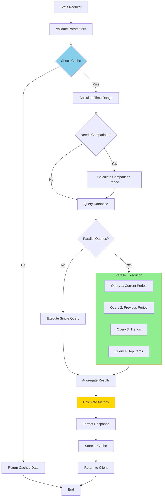
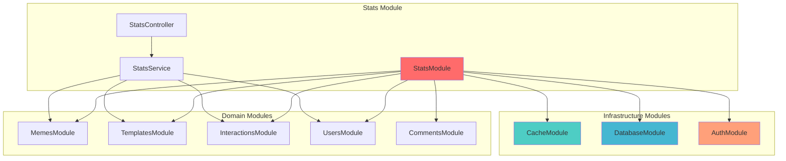
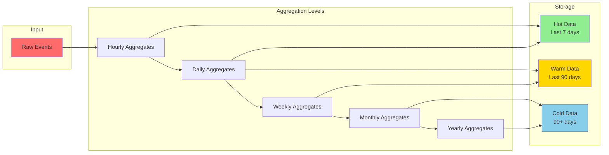
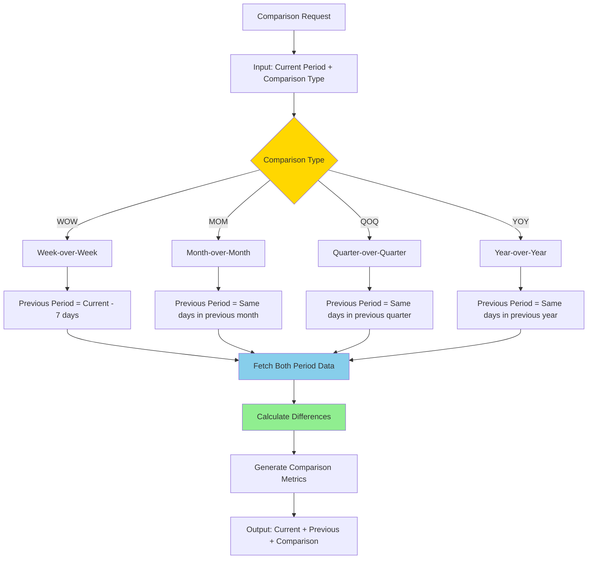
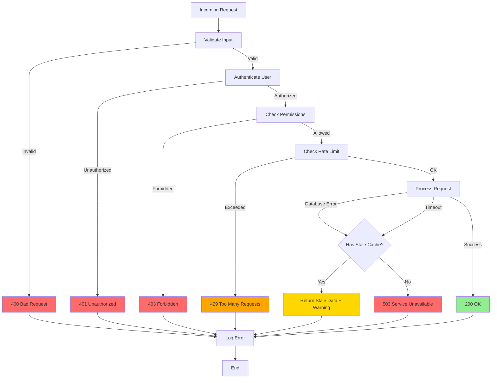
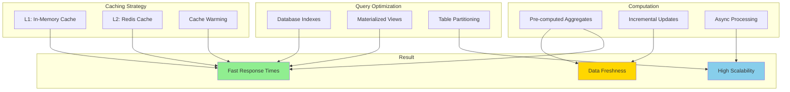

# Mermaid Diagrams: API Architecture

## System Architecture Diagram

## Request Flow Diagram

## Admin Statistics Flow

## Cache Strategy Diagram

## Data Aggregation Pipeline

## Module Dependencies

## Time-Series Aggregation

## Comparison Period Calculation

## Error Handling Flow

## Performance Optimization Strategy

