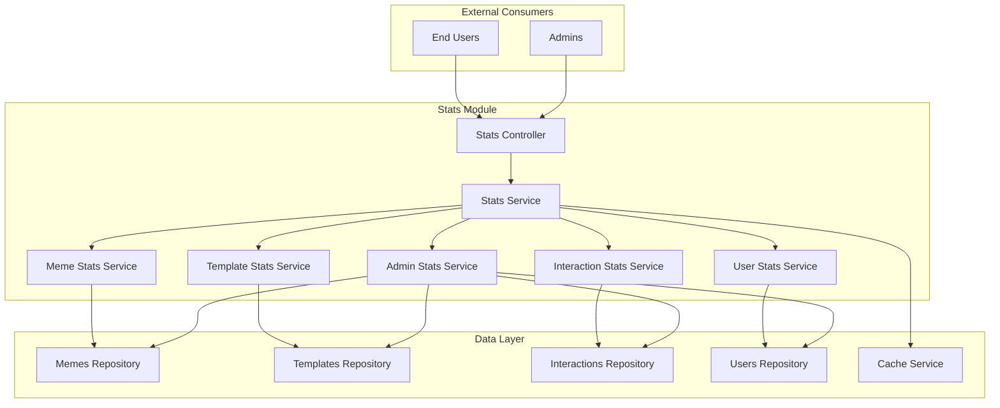

# Module: Statistics & Analytics

## Purpose & Scope

### Business Objective

The Statistics & Analytics module provides comprehensive data insights and performance metrics for the I Love Memes platform. It enables both end users and administrators to track content performance, user engagement, and system health through real-time and historical data analysis.

**Manufacturing Impact**: This is a data aggregation and reporting system that processes platform activity metrics at scale, requiring efficient query optimization, caching strategies, and time-series data management.

### Functional Boundaries

#### In Scope

- Real-time statistics generation for memes, templates, users, and interactions
- Historical trend analysis with comparative period analytics (WoW, MoM, QoQ, YoY)
- Dashboard APIs for end users (personal metrics)
- Dashboard APIs for administrators (platform-wide analytics)
- Time-series data aggregation and visualization support
- Performance metrics for content (upvotes, views, engagement rates)
- User activity tracking and reporting
- Template usage analytics
- Top content charts and trending analysis
- Caching layer for frequently accessed statistics

#### Out of Scope

- Real-time event streaming (uses existing database queries)
- Machine learning predictions and recommendations
- A/B testing framework
- Custom report generation and exports
- Third-party analytics integration (Google Analytics, Mixpanel)
- Data warehouse and ETL processes
- Business intelligence dashboards (focus on API endpoints)

### Success Metrics

- API response time < 500ms for statistics endpoints
- Cache hit rate > 80% for frequently accessed stats
- Data freshness < 5 minutes for real-time metrics
- Support for 1000+ concurrent statistics requests
- Query performance < 2 seconds for complex aggregations
- Historical data retention: 2 years of detailed metrics

## Architecture Overview

### High-Level Component Diagram



### Data Flow Patterns

1. **Request Flow**:
   - Client → Stats Controller → Stats Service → Specialized Service → Repository
   - Cache check at Stats Service level
   - Aggregation at Specialized Service level

2. **Caching Strategy**:
   - L1 Cache: In-memory for current session stats
   - L2 Cache: Redis for aggregated historical data
   - TTL varies by metric type (real-time: 1min, daily: 1hr, historical: 24hr)

3. **Aggregation Patterns**:
   - Pre-computed daily aggregates via scheduled jobs
   - On-demand aggregation for custom time ranges
   - Incremental updates for real-time counters

### Integration Touchpoints

#### Internal Modules

- **Memes Module**: Source data for meme performance metrics
- **Templates Module**: Source data for template usage analytics
- **Interactions Module**: Source data for engagement metrics (upvotes, downvotes, flags)
- **Users Module**: Source data for user activity and growth metrics
- **Comments Module**: Source data for discussion engagement metrics

#### External Systems

- **Redis Cache**: Temporary storage for computed statistics
- **PostgreSQL Database**: Primary data source with indexed time-series columns
- **Scheduled Jobs**: Background processing for pre-computation

## Dependencies & Constraints

### External System Dependencies

- **Database Performance**: Requires optimized indexes on timestamp columns
- **Cache Availability**: Redis must be available for performance targets
- **Query Complexity**: Complex aggregations may require database views or materialized tables
- **Data Volume**: Statistics accuracy depends on data retention policies

### Regulatory Compliance Requirements

- **Data Privacy**: User-specific statistics must respect privacy settings
- **Audit Trail**: Statistical reports should be traceable to source data
- **Data Retention**: Comply with GDPR and data retention regulations
- **Access Control**: Admin statistics require proper authorization

### Technical Constraints

- **Performance**: Must support high-concurrency read operations
- **Scalability**: Should handle growing data volumes without degradation
- **Real-time Accuracy**: Trade-off between freshness and performance
- **Time Zone Handling**: All timestamps must be UTC with client-side conversion

## Shared DNA Analysis

### Common Patterns with Other Modules

#### Memes Module (DNA Similarity: 65%)

**Shared Patterns**:

- Query optimization strategies for large datasets
- Pagination implementation for list endpoints
- Slug-based and ID-based entity resolution
- Soft-delete awareness in queries
- Filter and sort parameter handling

**Reusable Components**:

- `IPaginationOptions` interface
- `PaginatedResponse` DTO
- Repository query builders
- Common validation decorators

**Specialization Points**:

- Stats module focuses on read-heavy aggregation queries
- No CRUD operations (read-only module)
- Heavy use of GROUP BY, COUNT, SUM, AVG operations
- Time-series specific query patterns

#### Interactions Module (DNA Similarity: 55%)

**Shared Patterns**:

- Meme identifier resolution (slug or ID)
- User-specific filtering
- Interaction type enumeration
- Date range filtering

**Reusable Components**:

- `InteractionType` enum
- Meme resolution logic
- User authentication guards

**Specialization Points**:

- Stats aggregates interaction counts vs individual interactions
- Focus on metrics over entity management
- Time-based grouping and trending analysis

#### Templates Module (DNA Similarity: 45%)

**Shared Patterns**:

- Category-based filtering
- Tag-based filtering
- Public/private audience handling
- Search functionality

**Reusable Components**:

- Template entity relationships
- Category and tag associations
- Audience filtering logic

**Specialization Points**:

- Stats tracks template usage frequency
- Comparative analysis over time periods
- Adoption rate calculations

### Divergence Points

- **No Write Operations**: Stats module is read-only, unlike CRUD-heavy modules
- **Aggregation Focus**: Heavy use of database aggregation functions
- **Time-Series Queries**: Specialized queries for trend analysis
- **Caching Strategy**: More aggressive caching due to read-heavy nature
- **Response Format**: Includes metadata like period comparisons, growth rates, percentages

## API Strategy

### Endpoint Structure

```
GET /stats/user/dashboard              # End user personal dashboard
GET /stats/user/memes/:id/performance  # Individual meme performance
GET /stats/user/activity               # User activity over time

GET /stats/admin/overview              # Platform-wide overview
GET /stats/admin/templates/usage       # Template usage analytics
GET /stats/admin/memes/trending        # Trending memes
GET /stats/admin/users/growth          # User growth metrics
GET /stats/admin/interactions/summary  # Interaction statistics
GET /stats/admin/top-charts            # Top meme charts
```

### Authentication & Authorization

- **User Stats**: Requires JWT authentication (own data only)
- **Admin Stats**: Requires JWT + Admin role
- **Public Stats**: Limited set available without authentication (e.g., trending memes)

## Performance Considerations

### Caching Strategy

1. **Real-time Metrics** (TTL: 1 minute)
   - Active user counts
   - Recent interaction counts
   - Current trending content

2. **Daily Metrics** (TTL: 1 hour)
   - Daily meme creation counts
   - Daily engagement rates
   - Template usage for current day

3. **Historical Metrics** (TTL: 24 hours)
   - Monthly aggregates
   - Yearly comparisons
   - Growth trend data

### Database Optimization

- Compound indexes on (entity_id, timestamp) columns
- Materialized views for complex aggregations
- Partitioning for time-series tables
- Query result caching for expensive operations

## Risk Assessment

| Risk Type | Probability | Impact | Mitigation Strategy |
|-----------|-------------|--------|-------------------|
| Query Performance Degradation | High | 8 | Implement aggressive caching, optimize indexes, use materialized views |
| Cache Inconsistency | Medium | 6 | Use cache versioning, implement cache warming, short TTLs for critical data |
| Data Volume Growth | High | 7 | Implement data archiving, partition tables, optimize retention policies |
| Complex Query Timeout | Medium | 7 | Set query timeouts, implement query result pagination, use pre-computed aggregates |
| Real-time Data Staleness | Low | 4 | Document expected freshness, use WebSocket for critical updates if needed |
| Unauthorized Access to Admin Stats | Low | 9 | Implement strict role-based access control, audit logging for admin endpoints |

## Future Enhancements

- Custom date range exports (CSV, PDF)
- Real-time dashboard updates via WebSockets
- Predictive analytics and trend forecasting
- Anomaly detection for unusual patterns
- Customizable dashboard widgets
- Scheduled report generation and email delivery
- Integration with business intelligence tools
- Multi-tenant statistics isolation
