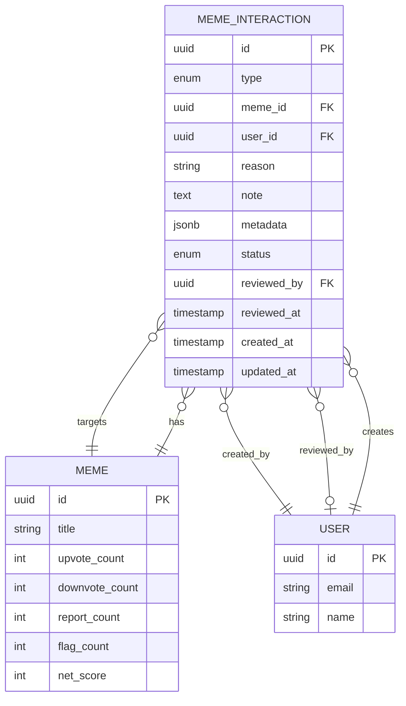

# Feature Specification: User Interactions

## Feature Overview

### Purpose & Scope

The User Interactions feature enables community engagement through voting, reporting, and content moderation mechanisms.
This feature allows users to express opinions, flag inappropriate content, and contribute to content quality through
various interaction types.

**Business Objective**: Build an engaged community by enabling users to interact with content through voting and
reporting mechanisms, while maintaining content quality through community-driven moderation.

**Manufacturing Impact**: This is a quality control and feedback system that enables user-driven content evaluation and
continuous improvement, similar to quality assurance checkpoints in manufacturing.

### Functional Boundaries

#### In Scope

- Upvote/Downvote mechanisms
- Report inappropriate content
- Flag content for review
- User interaction tracking (prevent duplicate interactions)
- Interaction aggregation and counts
- Search and sort memes by interaction metrics
- Interaction history per user
- Interaction timestamps
- Interaction type validation
- Rate limiting per user

#### Out of Scope

- Comment system (separate feature)
- Share functionality (separate feature)
- Like/favorite collections (future phase)
- Notification system for interactions
- Interaction analytics dashboard (separate feature)
- Reward system for interactions
- User reputation scoring

### Success Metrics

- Daily active interactions (upvotes, downvotes)
- Report-to-action ratio
- Average interactions per meme
- User engagement rate
- False report rate
- Moderation response time
- Interaction API response time < 150ms

---

## Functional Requirements

### FR-1: Upvote Meme

**Priority**: Critical

**Description**: Authenticated users must be able to upvote memes to express positive sentiment.

**Acceptance Criteria**:

```gherkin
Given an authenticated user
And a public meme exists
When the user upvotes the meme
Then an upvote interaction is created
  And the meme's upvote count is incremented
  And any existing downvote by the user is removed
  And the downvote count is decremented (if applicable)
  And the interaction is recorded with timestamp
```

**Business Rules**:

- One upvote per user per meme
- Authenticated users only
- Cannot upvote own memes (configurable)
- Upvoting removes existing downvote (toggle behavior)
- Upvoting again removes the upvote (toggle off)
- Private memes can only be upvoted by the owner

**Data Requirements**:

```typescript
interface CreateUpvoteDto {
  memeId: string;                    // Required, valid meme ID
  type: 'UPVOTE';                    // Required, interaction type
}

interface InteractionResponse {
  id: string;
  type: 'UPVOTE' | 'DOWNVOTE' | 'REPORT' | 'FLAG';
  meme: {
    id: string;
    title: string;
    slug: string;
  };
  user: {
    id: string;
    email: string;
  };
  createdAt: Date;
  metadata?: Record<string, any>;   // Optional additional data
}
```

### FR-2: Downvote Meme

**Priority**: Critical

**Description**: Authenticated users must be able to downvote memes to express negative sentiment.

**Acceptance Criteria**:

```gherkin
Given an authenticated user
And a public meme exists
When the user downvotes the meme
Then a downvote interaction is created
  And the meme's downvote count is incremented
  And any existing upvote by the user is removed
  And the upvote count is decremented (if applicable)
  And the interaction is recorded with timestamp
```

**Business Rules**:

- One downvote per user per meme
- Authenticated users only
- Cannot downvote own memes (configurable)
- Downvoting removes existing upvote (toggle behavior)
- Downvoting again removes the downvote (toggle off)
- Private memes can only be downvoted by the owner

### FR-3: Report Meme

**Priority**: High

**Description**: Users must be able to report memes for violating community guidelines.

**Acceptance Criteria**:

```gherkin
Given an authenticated user
And a meme exists
When the user reports the meme
  With a reason category and optional note
Then a report interaction is created
  And the report is added to moderation queue
  And the meme's report count is incremented
  And notification is sent to moderators
  And the user cannot report the same meme again
```

**Business Rules**:

- One report per user per meme
- Reason is required
- Optional detailed note (max 500 characters)
- Cannot report own memes
- High report count triggers auto-review
- Report threshold (e.g., 5 reports) flags meme for immediate review

**Report Reasons**:

- `SPAM` - Spam or misleading content
- `INAPPROPRIATE` - Inappropriate or offensive content
- `COPYRIGHT` - Copyright violation
- `NSFW` - Not safe for work content
- `HARASSMENT` - Harassment or bullying
- `VIOLENCE` - Violent or graphic content
- `OTHER` - Other reason (requires note)

**Data Requirements**:

```typescript
interface CreateReportDto {
  memeId: string;                    // Required, valid meme ID
  type: 'REPORT';                    // Required, interaction type
  reason: ReportReason;              // Required, reason category
  note?: string;                     // Optional, max 500 characters
}

enum ReportReason {
  SPAM = 'SPAM',
  INAPPROPRIATE = 'INAPPROPRIATE',
  COPYRIGHT = 'COPYRIGHT',
  NSFW = 'NSFW',
  HARASSMENT = 'HARASSMENT',
  VIOLENCE = 'VIOLENCE',
  OTHER = 'OTHER'
}
```

### FR-4: Flag Meme

**Priority**: High

**Description**: Users must be able to flag memes for review without formal reporting.

**Acceptance Criteria**:

```gherkin
Given an authenticated user
And a meme exists
When the user flags the meme
  With an optional note
Then a flag interaction is created
  And the meme's flag count is incremented
  And the flag is recorded for review
  And the user cannot flag the same meme again
```

**Business Rules**:

- One flag per user per meme
- Optional note (max 200 characters)
- Cannot flag own memes
- Flags are less severe than reports
- High flag count (e.g., 10 flags) suggests content review

### FR-5: Remove Interaction

**Priority**: High

**Description**: Users must be able to remove their own interactions (upvote/downvote/flag).

**Acceptance Criteria**:

```gherkin
Given an authenticated user has interacted with a meme
When the user removes their interaction
Then the interaction is deleted
  And the interaction count is decremented
  And the user can interact again later
```

**Business Rules**:

- Users can only remove their own interactions
- Reports cannot be removed once submitted
- Removing upvote/downvote decrements count
- Removing flag decrements flag count

### FR-6: Get Meme Interactions Summary

**Priority**: Critical

**Description**: System must provide aggregated interaction counts for memes.

**Acceptance Criteria**:

```gherkin
Given a meme exists
When requesting meme details
Then interaction summary is included
  With upvote count
  And downvote count
  And report count
  And flag count
  And user's current interaction (if authenticated)
```

**Aggregation Data**:

```typescript
interface MemeInteractionsSummary {
  memeId: string;
  upvoteCount: number;
  downvoteCount: number;
  reportCount: number;
  flagCount: number;
  netScore: number;                 // upvotes - downvotes
  engagementScore: number;          // custom algorithm
  userInteraction?: {
    type: 'UPVOTE' | 'DOWNVOTE' | 'FLAG';
    createdAt: Date;
  };
}
```

### FR-7: Sort and Filter Memes by Interactions

**Priority**: High

**Description**: Users must be able to sort and filter memes based on interaction metrics.

**Acceptance Criteria**:

```gherkin
Given multiple memes with interactions exist
When a user requests meme list
Then memes can be sorted by:
  - Most upvoted (DESC)
  - Least downvoted (ASC)
  - Highest net score (upvotes - downvotes DESC)
  - Most controversial (high votes both ways)
  - Most reported
  - Most flagged
And memes can be filtered by:
  - Minimum upvote threshold
  - Maximum downvote threshold
  - Net score range
```

**Sort Options**:

- `upvotes:DESC` - Most upvoted first
- `downvotes:ASC` - Least downvoted first
- `netScore:DESC` - Highest net score first
- `controversial:DESC` - High engagement both ways
- `trending:DESC` - Trending algorithm (time + engagement)

### FR-8: Get User Interaction History

**Priority**: Medium

**Description**: Users must be able to view their interaction history.

**Acceptance Criteria**:

```gherkin
Given an authenticated user
When the user requests their interaction history
Then a list of their interactions is returned
  With interaction type
  And target meme details
  And interaction timestamp
  And pagination support
```

---

## Non-Functional Requirements

### Performance Requirements

| Operation                | Target Response Time | Maximum Load         |
|--------------------------|----------------------|----------------------|
| Create Upvote            | < 100ms              | 500 req/min per user |
| Create Downvote          | < 100ms              | 500 req/min per user |
| Create Report            | < 150ms              | 10 req/min per user  |
| Create Flag              | < 150ms              | 20 req/min per user  |
| Remove Interaction       | < 100ms              | 100 req/min per user |
| Get Interactions Summary | < 50ms               | 1000 req/min         |
| Get User History         | < 200ms              | 100 req/min          |
| Sort by Interactions     | < 300ms              | 500 req/min          |

### Security Requirements

- **Authentication**: All interactions require JWT authentication
- **Authorization**: Users can only manage their own interactions
- **Rate Limiting**: Prevent interaction spam
    - Max 10 interactions per minute per user
    - Max 5 reports per hour per user
- **Input Validation**: All inputs sanitized and validated
- **XSS Prevention**: Escape user-provided notes
- **Duplicate Prevention**: Unique constraint on user-meme-type

### Data Integrity

- **Unique Constraints**: One interaction type per user per meme
- **Foreign Key Constraints**: User and meme references
- **Cascade Rules**: Delete interactions when meme deleted
- **Transaction Support**: Atomic count updates
- **Consistency**: Counts always match interaction records

### Scalability Requirements

- Support 1M+ interactions in database
- Handle 10,000+ concurrent users
- Real-time count updates
- Database indexing on frequently queried fields
- Cache interaction summaries for popular memes
- Event-driven count aggregation (optional)

---

## Database Schema

### Interaction Entity

```sql
CREATE TABLE meme_interactions (
  id UUID PRIMARY KEY DEFAULT gen_random_uuid(),

  -- Core Fields
  type VARCHAR(20) NOT NULL,

  -- Relationships
  meme_id UUID NOT NULL REFERENCES memes(id) ON DELETE CASCADE,
  user_id UUID NOT NULL REFERENCES users(id) ON DELETE CASCADE,

  -- Report/Flag Specific
  reason VARCHAR(50),                -- For REPORT type
  note TEXT,                         -- Optional note for REPORT/FLAG

  -- Metadata
  metadata JSONB,                    -- Flexible additional data

  -- Status (for reports)
  status VARCHAR(20) DEFAULT 'PENDING', -- PENDING, REVIEWED, RESOLVED, DISMISSED
  reviewed_by UUID REFERENCES users(id),
  reviewed_at TIMESTAMP,

  -- Timestamps
  created_at TIMESTAMP DEFAULT CURRENT_TIMESTAMP,
  updated_at TIMESTAMP DEFAULT CURRENT_TIMESTAMP,

  -- Indexes
  INDEX idx_interactions_meme (meme_id),
  INDEX idx_interactions_user (user_id),
  INDEX idx_interactions_type (type),
  INDEX idx_interactions_status (status),
  INDEX idx_interactions_created_at (created_at DESC),

  -- Unique constraint: one interaction type per user per meme
  CONSTRAINT uk_user_meme_type UNIQUE (user_id, meme_id, type),

  -- Constraints
  CONSTRAINT chk_type CHECK (type IN ('UPVOTE', 'DOWNVOTE', 'REPORT', 'FLAG')),
  CONSTRAINT chk_status CHECK (status IN ('PENDING', 'REVIEWED', 'RESOLVED', 'DISMISSED')),
  CONSTRAINT chk_report_reason CHECK (
    (type = 'REPORT' AND reason IS NOT NULL) OR
    (type != 'REPORT')
  )
);

-- Materialized view for interaction counts (for performance)
CREATE MATERIALIZED VIEW meme_interaction_counts AS
SELECT
  meme_id,
  COUNT(*) FILTER (WHERE type = 'UPVOTE') as upvote_count,
  COUNT(*) FILTER (WHERE type = 'DOWNVOTE') as downvote_count,
  COUNT(*) FILTER (WHERE type = 'REPORT') as report_count,
  COUNT(*) FILTER (WHERE type = 'FLAG') as flag_count,
  COUNT(*) FILTER (WHERE type = 'UPVOTE') -
    COUNT(*) FILTER (WHERE type = 'DOWNVOTE') as net_score
FROM meme_interactions
GROUP BY meme_id;

CREATE UNIQUE INDEX idx_interaction_counts_meme ON meme_interaction_counts(meme_id);

-- Refresh materialized view periodically or on interaction changes
-- REFRESH MATERIALIZED VIEW CONCURRENTLY meme_interaction_counts;

-- Alternative: Add computed columns to memes table
ALTER TABLE memes ADD COLUMN upvote_count INTEGER DEFAULT 0;
ALTER TABLE memes ADD COLUMN downvote_count INTEGER DEFAULT 0;
ALTER TABLE memes ADD COLUMN report_count INTEGER DEFAULT 0;
ALTER TABLE memes ADD COLUMN flag_count INTEGER DEFAULT 0;
ALTER TABLE memes ADD COLUMN net_score INTEGER GENERATED ALWAYS AS (upvote_count - downvote_count) STORED;

CREATE INDEX idx_memes_upvote_count ON memes(upvote_count DESC);
CREATE INDEX idx_memes_downvote_count ON memes(downvote_count ASC);
CREATE INDEX idx_memes_net_score ON memes(net_score DESC);
CREATE INDEX idx_memes_report_count ON memes(report_count DESC);
```

### Relationships



---

## API Endpoints

### Create Upvote

```http
POST /v1/memes/:memeId/interactions
Authorization: Bearer <token>
Content-Type: application/json

Request Body:
{
  "type": "UPVOTE"
}

Response 201 Created:
{
  "success": true,
  "message": "Upvote created successfully",
  "data": {
    "id": "interaction-uuid",
    "type": "UPVOTE",
    "meme": {
      "id": "meme-uuid",
      "title": "Funny Cat Meme",
      "slug": "funny-cat-meme"
    },
    "user": {
      "id": "user-uuid",
      "email": "user@example.com"
    },
    "createdAt": "2025-11-07T10:00:00Z"
  },
  "meta": {
    "upvoteCount": 156,
    "downvoteCount": 12,
    "netScore": 144
  }
}
```

### Create Downvote

```http
POST /v1/memes/:memeId/interactions
Authorization: Bearer <token>
Content-Type: application/json

Request Body:
{
  "type": "DOWNVOTE"
}

Response 201 Created:
{
  "success": true,
  "message": "Downvote created successfully",
  "data": {
    "id": "interaction-uuid",
    "type": "DOWNVOTE",
    "meme": {
      "id": "meme-uuid",
      "title": "Funny Cat Meme"
    },
    "createdAt": "2025-11-07T10:00:00Z"
  },
  "meta": {
    "upvoteCount": 155,
    "downvoteCount": 13,
    "netScore": 142
  }
}
```

### Create Report

```http
POST /v1/memes/:memeId/interactions
Authorization: Bearer <token>
Content-Type: application/json

Request Body:
{
  "type": "REPORT",
  "reason": "INAPPROPRIATE",
  "note": "This meme contains offensive content that violates community guidelines."
}

Response 201 Created:
{
  "success": true,
  "message": "Report submitted successfully",
  "data": {
    "id": "interaction-uuid",
    "type": "REPORT",
    "reason": "INAPPROPRIATE",
    "note": "This meme contains offensive content...",
    "status": "PENDING",
    "meme": {
      "id": "meme-uuid",
      "title": "Controversial Meme"
    },
    "createdAt": "2025-11-07T10:00:00Z"
  }
}
```

### Create Flag

```http
POST /v1/memes/:memeId/interactions
Authorization: Bearer <token>
Content-Type: application/json

Request Body:
{
  "type": "FLAG",
  "note": "Questionable content"
}

Response 201 Created:
{
  "success": true,
  "message": "Flag created successfully",
  "data": {
    "id": "interaction-uuid",
    "type": "FLAG",
    "note": "Questionable content",
    "meme": {
      "id": "meme-uuid",
      "title": "Meme Title"
    },
    "createdAt": "2025-11-07T10:00:00Z"
  }
}
```

### Remove Interaction

```http
DELETE /v1/memes/:memeId/interactions/:interactionType
Authorization: Bearer <token>

# Examples:
# DELETE /v1/memes/123/interactions/upvote
# DELETE /v1/memes/123/interactions/downvote
# DELETE /v1/memes/123/interactions/flag

Response 200 OK:
{
  "success": true,
  "message": "Interaction removed successfully",
  "meta": {
    "upvoteCount": 155,
    "downvoteCount": 12,
    "netScore": 143
  }
}
```

### Get Meme with Interactions

```http
GET /v1/memes/:memeId
Authorization: Optional

Response 200 OK:
{
  "success": true,
  "message": "Meme fetched successfully",
  "data": {
    "id": "meme-uuid",
    "title": "Funny Cat Meme",
    "slug": "funny-cat-meme",
    "file": {
      "path": "/uploads/cat-meme.jpg"
    },
    "interactions": {
      "upvoteCount": 156,
      "downvoteCount": 12,
      "reportCount": 0,
      "flagCount": 1,
      "netScore": 144,
      "engagementScore": 168
    },
    "userInteraction": {
      "type": "UPVOTE",
      "createdAt": "2025-11-07T09:00:00Z"
    },
    "createdAt": "2025-11-07T08:00:00Z"
  }
}
```

### Get User Interaction History

```http
GET /v1/users/me/interactions?page=1&limit=20&type=UPVOTE
Authorization: Bearer <token>

Response 200 OK:
{
  "success": true,
  "message": "Interaction history fetched successfully",
  "data": [
    {
      "id": "interaction-uuid",
      "type": "UPVOTE",
      "meme": {
        "id": "meme-uuid",
        "title": "Funny Cat Meme",
        "slug": "funny-cat-meme",
        "file": {
          "path": "/uploads/cat-meme.jpg"
        }
      },
      "createdAt": "2025-11-07T10:00:00Z"
    }
  ],
  "meta": {
    "page": 1,
    "limit": 20,
    "total": 45,
    "totalPages": 3,
    "summary": {
      "totalUpvotes": 32,
      "totalDownvotes": 8,
      "totalReports": 3,
      "totalFlags": 2
    }
  }
}
```

### Sort Memes by Interactions

```http
GET /v1/memes?sort=upvotes&order=DESC&page=1&limit=20
GET /v1/memes?sort=netScore&order=DESC&page=1&limit=20
GET /v1/memes?sort=controversial&page=1&limit=20
Authorization: Optional

Response 200 OK:
{
  "success": true,
  "message": "Memes fetched successfully",
  "data": [
    {
      "id": "meme-uuid",
      "title": "Top Meme",
      "slug": "top-meme",
      "file": {
        "path": "/uploads/top-meme.jpg"
      },
      "interactions": {
        "upvoteCount": 5234,
        "downvoteCount": 123,
        "netScore": 5111
      },
      "createdAt": "2025-11-06T10:00:00Z"
    }
  ],
  "meta": {
    "page": 1,
    "limit": 20,
    "total": 1523,
    "totalPages": 77
  }
}
```

### Get Trending Memes

```http
GET /v1/memes/trending?timeWindow=7d&limit=20
Authorization: Optional

Response 200 OK:
{
  "success": true,
  "message": "Trending memes fetched successfully",
  "data": [
    {
      "id": "meme-uuid",
      "title": "Trending Meme",
      "slug": "trending-meme",
      "interactions": {
        "upvoteCount": 1234,
        "netScore": 1150,
        "trendingScore": 89.5
      },
      "createdAt": "2025-11-05T10:00:00Z"
    }
  ]
}
```

---

## Business Logic & Rules

### Toggle Interaction Logic

```typescript
async function createOrToggleInteraction(
  userId: string,
  memeId: string,
  type: 'UPVOTE' | 'DOWNVOTE'
): Promise<InteractionResult> {
  // Check if user already has this interaction
  const existing = await interactionsRepository.findOne({
    where: { userId, memeId, type }
  });

  if (existing) {
    // Toggle off - remove interaction
    await interactionsRepository.delete(existing.id);
    await decrementInteractionCount(memeId, type);

    return {
      action: 'REMOVED',
      interaction: null,
      counts: await getInteractionCounts(memeId)
    };
  }

  // Check for opposite interaction
  const oppositeType = type === 'UPVOTE' ? 'DOWNVOTE' : 'UPVOTE';
  const opposite = await interactionsRepository.findOne({
    where: { userId, memeId, type: oppositeType }
  });

  // Start transaction
  await database.transaction(async (trx) => {
    // Remove opposite if exists
    if (opposite) {
      await trx('meme_interactions').where('id', opposite.id).delete();
      await decrementInteractionCount(memeId, oppositeType, trx);
    }

    // Create new interaction
    const interaction = await trx('meme_interactions').insert({
      userId,
      memeId,
      type,
      createdAt: new Date()
    });

    await incrementInteractionCount(memeId, type, trx);
  });

  return {
    action: 'CREATED',
    interaction: await findInteraction(userId, memeId, type),
    counts: await getInteractionCounts(memeId)
  };
}
```

### Interaction Count Management

```typescript
// Using database triggers (recommended)
CREATE OR REPLACE FUNCTION update_meme_interaction_counts()
RETURNS TRIGGER AS $$
BEGIN
  IF TG_OP = 'INSERT' THEN
    CASE NEW.type
      WHEN 'UPVOTE' THEN
        UPDATE memes SET upvote_count = upvote_count + 1 WHERE id = NEW.meme_id;
      WHEN 'DOWNVOTE' THEN
        UPDATE memes SET downvote_count = downvote_count + 1 WHERE id = NEW.meme_id;
      WHEN 'REPORT' THEN
        UPDATE memes SET report_count = report_count + 1 WHERE id = NEW.meme_id;
      WHEN 'FLAG' THEN
        UPDATE memes SET flag_count = flag_count + 1 WHERE id = NEW.meme_id;
    END CASE;
    RETURN NEW;
  ELSIF TG_OP = 'DELETE' THEN
    CASE OLD.type
      WHEN 'UPVOTE' THEN
        UPDATE memes SET upvote_count = upvote_count - 1 WHERE id = OLD.meme_id;
      WHEN 'DOWNVOTE' THEN
        UPDATE memes SET downvote_count = downvote_count - 1 WHERE id = OLD.meme_id;
      WHEN 'REPORT' THEN
        UPDATE memes SET report_count = report_count - 1 WHERE id = OLD.meme_id;
      WHEN 'FLAG' THEN
        UPDATE memes SET flag_count = flag_count - 1 WHERE id = OLD.meme_id;
    END CASE;
    RETURN OLD;
  END IF;
  RETURN NULL;
END;
$$ LANGUAGE plpgsql;

CREATE TRIGGER trigger_update_interaction_counts
AFTER INSERT OR DELETE ON meme_interactions
FOR EACH ROW EXECUTE FUNCTION update_meme_interaction_counts();

// TypeScript implementation (alternative)
async function incrementInteractionCount(
  memeId: string,
  type: InteractionType,
  trx?: Transaction
): Promise<void> {
  const field = `${type.toLowerCase()}_count`;
  const query = (trx || database)('memes')
    .where('id', memeId)
    .increment(field, 1);

  await query;
}

async function decrementInteractionCount(
  memeId: string,
  type: InteractionType,
  trx?: Transaction
): Promise<void> {
  const field = `${type.toLowerCase()}_count`;
  const query = (trx || database)('memes')
    .where('id', memeId)
    .decrement(field, 1);

  await query;
}
```

### Trending Score Algorithm

```typescript
interface TrendingConfig {
  timeWindow: number;      // hours
  upvoteWeight: number;    // e.g., 1.0
  downvoteWeight: number;  // e.g., -0.5
  ageDecayFactor: number;  // e.g., 2.0
}

function calculateTrendingScore(
  meme: Meme,
  config: TrendingConfig = {
    timeWindow: 168,        // 7 days
    upvoteWeight: 1.0,
    downvoteWeight: -0.5,
    ageDecayFactor: 2.0
  }
): number {
  const now = Date.now();
  const createdAt = meme.createdAt.getTime();
  const ageInHours = (now - createdAt) / (1000 * 60 * 60);

  // Ignore memes older than time window
  if (ageInHours > config.timeWindow) {
    return 0;
  }

  // Calculate engagement score
  const engagementScore =
    (meme.upvoteCount * config.upvoteWeight) +
    (meme.downvoteCount * config.downvoteWeight);

  // Apply age decay
  const ageFactor = Math.pow(
    (config.timeWindow - ageInHours) / config.timeWindow,
    config.ageDecayFactor
  );

  return engagementScore * ageFactor;
}

// SQL implementation for efficient querying
SELECT
  m.*,
  (
    (m.upvote_count * 1.0) +
    (m.downvote_count * -0.5)
  ) * POWER(
    (168 - EXTRACT(EPOCH FROM (NOW() - m.created_at)) / 3600) / 168,
    2.0
  ) as trending_score
FROM memes m
WHERE m.created_at > NOW() - INTERVAL '7 days'
  AND m.audience = 'PUBLIC'
  AND m.deleted_at IS NULL
ORDER BY trending_score DESC
LIMIT 20;
```

### Controversial Content Detection

```typescript
function calculateControversyScore(
  upvotes: number,
  downvotes: number
): number {
  // Wilson score for controversy
  // High scores when votes are balanced and numerous

  const total = upvotes + downvotes;

  if (total === 0) return 0;

  const balance = Math.min(upvotes, downvotes) / Math.max(upvotes, downvotes);
  const volume = Math.log(total + 1);

  return balance * volume;
}

// Get controversial memes
async function getControversialMemes(limit: number = 20): Promise<Meme[]> {
  const memes = await memesRepository.find({
    where: {
      audience: 'PUBLIC',
      deletedAt: IsNull()
    },
    order: {
      upvoteCount: 'DESC'
    },
    take: 1000  // Get top voted memes
  });

  // Calculate controversy scores
  const scored = memes.map(meme => ({
    ...meme,
    controversyScore: calculateControversyScore(
      meme.upvoteCount,
      meme.downvoteCount
    )
  }));

  // Sort by controversy and return top
  return scored
    .sort((a, b) => b.controversyScore - a.controversyScore)
    .slice(0, limit);
}
```

### Report Threshold Alert

```typescript
async function checkReportThreshold(memeId: string): Promise<void> {
  const meme = await memesRepository.findById(memeId);

  const REPORT_THRESHOLD = 5;
  const HIGH_REPORT_THRESHOLD = 10;

  if (meme.reportCount >= HIGH_REPORT_THRESHOLD) {
    // Auto-hide meme and notify admins
    await memesRepository.update(memeId, {
      status: 'UNDER_REVIEW'
    });

    await notificationService.notifyAdmins({
      type: 'HIGH_REPORT_COUNT',
      memeId,
      reportCount: meme.reportCount
    });
  } else if (meme.reportCount >= REPORT_THRESHOLD) {
    // Flag for review
    await moderationQueue.add({
      memeId,
      priority: 'HIGH',
      reason: 'REPORT_THRESHOLD_REACHED'
    });
  }
}
```

### Rate Limiting

```typescript
// Using Redis for distributed rate limiting
async function checkInteractionRateLimit(
  userId: string,
  type: InteractionType
): Promise<void> {
  const limits = {
    UPVOTE: { count: 100, window: 60 },      // 100 per minute
    DOWNVOTE: { count: 100, window: 60 },    // 100 per minute
    REPORT: { count: 5, window: 3600 },      // 5 per hour
    FLAG: { count: 20, window: 3600 }        // 20 per hour
  };

  const limit = limits[type];
  const key = `ratelimit:interaction:${type}:${userId}`;

  const current = await redis.incr(key);

  if (current === 1) {
    await redis.expire(key, limit.window);
  }

  if (current > limit.count) {
    const ttl = await redis.ttl(key);
    throw new RateLimitException(
      `Rate limit exceeded. Try again in ${ttl} seconds.`
    );
  }
}
```

---

## Integration Points

### Dependencies

- **Memes Module**: Target content for interactions
- **Users Module**: Interaction creators
- **Moderation Module**: Report processing
- **Notification Module**: Alert moderators

### External Integrations

- **Cache Service**: Popular interaction counts
- **Queue Service**: Report processing
- **Analytics Service**: Interaction tracking
- **Notification Service**: Moderation alerts

---

## Error Handling

### Error Scenarios

| Scenario                      | HTTP Status | Error Code       | Message                                    |
|-------------------------------|-------------|------------------|--------------------------------------------|
| Unauthenticated               | 401         | UNAUTHORIZED     | User not authenticated                     |
| Cannot interact with own meme | 403         | FORBIDDEN        | Cannot interact with your own meme         |
| Meme not found                | 404         | NOT_FOUND        | Meme not found                             |
| Duplicate interaction         | 409         | DUPLICATE        | You have already interacted with this meme |
| Rate limit exceeded           | 429         | RATE_LIMIT       | Too many interactions. Try again later     |
| Missing report reason         | 400         | VALIDATION_ERROR | Report reason is required                  |
| Invalid interaction type      | 400         | INVALID_TYPE     | Invalid interaction type                   |

---

## Testing Strategy

### Unit Tests

- Toggle interaction logic
- Count increment/decrement
- Trending score calculation
- Controversy score calculation
- Rate limiting logic
- Report threshold checks

### Integration Tests

- Create and remove interactions
- Opposite interaction handling
- Count consistency
- Sort by interactions
- Filter by interaction metrics
- User interaction history

### E2E Tests

- Complete voting workflow
- Report submission and processing
- Trending memes display
- Controversial content identification
- Rate limit enforcement

---

## Monitoring & Logging

### Key Metrics

- Interactions per minute
- Upvote/downvote ratio
- Report rate
- False report rate
- Average response time
- Rate limit hits

### Alerts

- High report rate on single meme
- Sudden spike in downvotes
- Rate limit abuse
- API response time > 200ms

---

## Future Enhancements

### Phase 2

- Reaction types (laugh, love, angry, etc.)
- Interaction notifications
- User reputation system
- Interaction leaderboards
- Badge/achievement system

### Phase 3

- ML-powered report classification
- Auto-moderation based on interaction patterns
- Interaction analytics dashboard
- A/B testing for interaction UI
- Social proof indicators

---

## Changelog

| Version | Date       | Changes                       |
|---------|------------|-------------------------------|
| 1.0.0   | 2025-11-07 | Initial feature specification |
